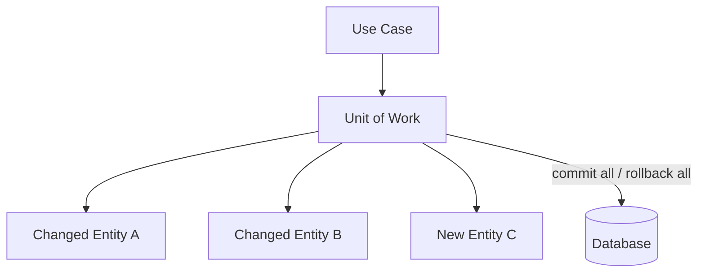
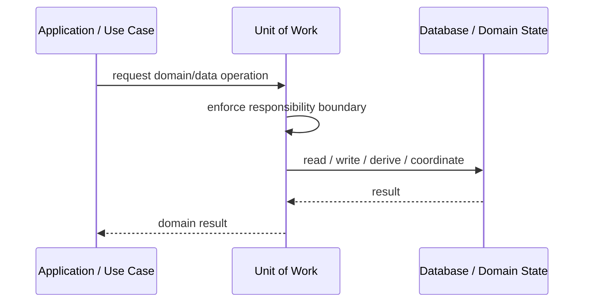
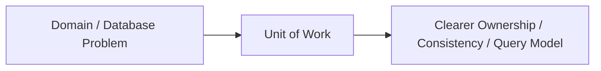

# Unit of Work

## Core Idea

Unit of Work tracks changes to objects during a business transaction and commits them together.

---

## Problem It Solves

Multiple changes must be saved atomically, but scattered save calls make consistency hard to control.

---

## 3 Concrete Examples

### Example 1: Order Checkout

Create order, reserve inventory, and update customer balance in one transaction scope.

### Example 2: Bank Transfer

Debit one account, credit another, and record transaction as one unit.

### Example 3: Bulk Import

Track created and modified entities, then commit or rollback the batch.

---

## Architect Questions

- What is the transaction boundary?
- Which objects are changed inside the unit?
- When are changes flushed to the database?
- What happens if one save fails?
- Does the ORM already provide Unit of Work?
- How does this interact with repositories?

---

## Main Diagram



---

## Runtime / Responsibility Flow



---

## Implementation Shape

```txt
1. Identify the domain or persistence problem.
2. Define the ownership boundary: entity, aggregate, repository, table, tenant, shard, view, or event stream.
3. Define invariants and consistency requirements.
4. Define how data is loaded, changed, saved, queried, and audited.
5. Define transaction behavior and failure behavior.
6. Add tests around business rules, persistence mapping, concurrency, and edge cases.
7. Keep the pattern focused. Do not use database patterns to hide unclear domain modeling.
```

---

## When to Use

- Multiple changes must commit or rollback together.
- You need one transaction boundary around a use case.
- An ORM/session already tracks changes.

---

## When Not to Use

- Only one simple write occurs.
- Transactions are not needed.
- The abstraction conflicts with the framework's transaction model.

---

## Common Smell That Suggests This Pattern

```txt
Business rules, persistence logic, identity, history, or query needs are becoming unclear,
duplicated,
too coupled to database details,
or too slow for the current model.
```

---

## Common Mistakes

```txt
Confusing database tables with domain concepts.

Adding abstractions that only pass calls through.

Letting persistence concerns dominate the domain model.

Ignoring transaction boundaries.

Ignoring concurrency and stale data.

Using a complex DDD pattern for simple CRUD.

Using simple CRUD patterns for a complex domain.
```

---

## Best Visual Summary



## Final Meaning

Unit of Work is useful when it protects business meaning, data consistency, query performance, or persistence boundaries. If the problem is simple CRUD, do not overcomplicate it.
