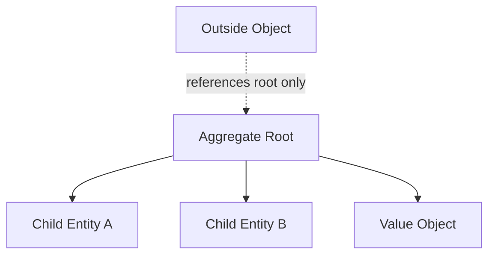
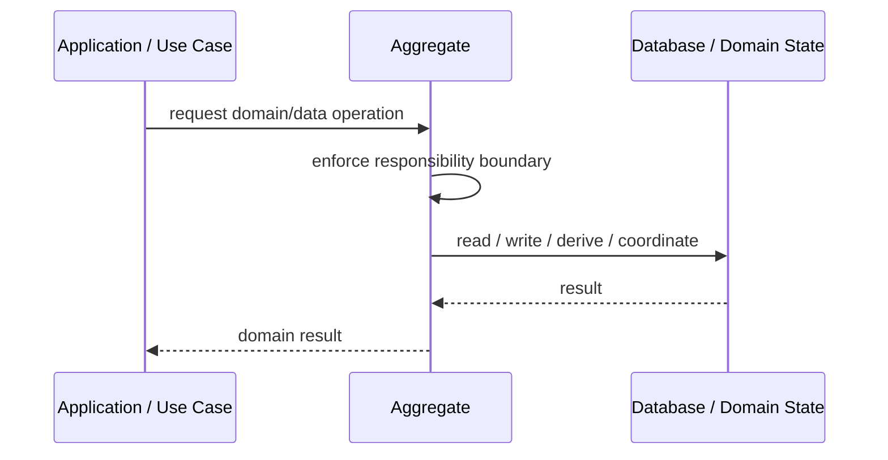
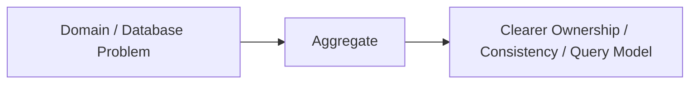

# Aggregate

## Core Idea

An Aggregate is a cluster of domain objects treated as one consistency boundary, controlled by an aggregate root.

---

## Problem It Solves

Related entities can be modified inconsistently when every object is changed directly from anywhere.

---

## 3 Concrete Examples

### Example 1: Order Aggregate

Order root controls order lines, totals, discounts, and status transitions.

### Example 2: Shopping Cart Aggregate

Cart root controls items, quantities, and pricing rules.

### Example 3: Bank Account Aggregate

Account root controls balance changes and transaction rules.

---

## Architect Questions

- What invariants must always stay consistent?
- Which entity is the aggregate root?
- What objects belong inside the boundary?
- What should be referenced by ID instead of contained?
- How large is the aggregate?
- Does this boundary match transaction needs?

---

## Main Diagram



---

## Runtime / Responsibility Flow



---

## Implementation Shape

```txt
1. Identify the domain or persistence problem.
2. Define the ownership boundary: entity, aggregate, repository, table, tenant, shard, view, or event stream.
3. Define invariants and consistency requirements.
4. Define how data is loaded, changed, saved, queried, and audited.
5. Define transaction behavior and failure behavior.
6. Add tests around business rules, persistence mapping, concurrency, and edge cases.
7. Keep the pattern focused. Do not use database patterns to hide unclear domain modeling.
```

---

## When to Use

- You need a consistency boundary around related objects.
- Invariants span multiple child objects.
- Only one root should control modifications.

---

## When Not to Use

- The object graph is huge and causes contention.
- There are no real invariants.
- You use aggregates as arbitrary folders.

---

## Common Smell That Suggests This Pattern

```txt
Business rules, persistence logic, identity, history, or query needs are becoming unclear,
duplicated,
too coupled to database details,
or too slow for the current model.
```

---

## Common Mistakes

```txt
Confusing database tables with domain concepts.

Adding abstractions that only pass calls through.

Letting persistence concerns dominate the domain model.

Ignoring transaction boundaries.

Ignoring concurrency and stale data.

Using a complex DDD pattern for simple CRUD.

Using simple CRUD patterns for a complex domain.
```

---

## Best Visual Summary



## Final Meaning

Aggregate is useful when it protects business meaning, data consistency, query performance, or persistence boundaries. If the problem is simple CRUD, do not overcomplicate it.
