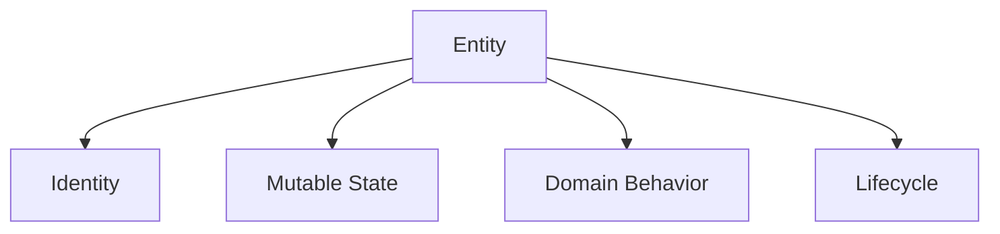
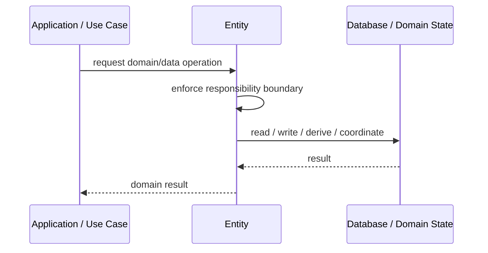
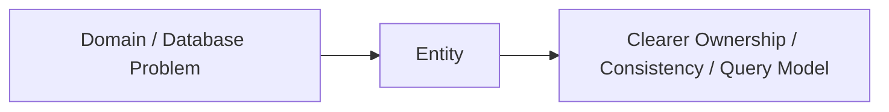

# Entity

## Core Idea

An Entity is a domain object defined by identity and lifecycle rather than only its attributes.

---

## Problem It Solves

The system needs to track the same conceptual object over time even as its data changes.

---

## 3 Concrete Examples

### Example 1: Customer Entity

A customer keeps the same identity even when name or address changes.

### Example 2: Order Entity

An order is tracked by order ID through created, paid, shipped, and cancelled states.

### Example 3: Employee Entity

An employee remains the same employee through role, manager, and salary changes.

---

## Architect Questions

- What makes this object the same object over time?
- What is its identity?
- What lifecycle states does it have?
- Which attributes can change?
- Which invariants must the entity protect?
- Is this really an entity or just a value object?

---

## Main Diagram



---

## Runtime / Responsibility Flow



---

## Implementation Shape

```txt
1. Identify the domain or persistence problem.
2. Define the ownership boundary: entity, aggregate, repository, table, tenant, shard, view, or event stream.
3. Define invariants and consistency requirements.
4. Define how data is loaded, changed, saved, queried, and audited.
5. Define transaction behavior and failure behavior.
6. Add tests around business rules, persistence mapping, concurrency, and edge cases.
7. Keep the pattern focused. Do not use database patterns to hide unclear domain modeling.
```

---

## When to Use

- Object identity matters over time.
- The object has a lifecycle.
- Attributes can change while identity remains stable.

---

## When Not to Use

- The concept is fully defined by attributes.
- There is no lifecycle or identity.
- A value object would be simpler.

---

## Common Smell That Suggests This Pattern

```txt
Business rules, persistence logic, identity, history, or query needs are becoming unclear,
duplicated,
too coupled to database details,
or too slow for the current model.
```

---

## Common Mistakes

```txt
Confusing database tables with domain concepts.

Adding abstractions that only pass calls through.

Letting persistence concerns dominate the domain model.

Ignoring transaction boundaries.

Ignoring concurrency and stale data.

Using a complex DDD pattern for simple CRUD.

Using simple CRUD patterns for a complex domain.
```

---

## Best Visual Summary



## Final Meaning

Entity is useful when it protects business meaning, data consistency, query performance, or persistence boundaries. If the problem is simple CRUD, do not overcomplicate it.
