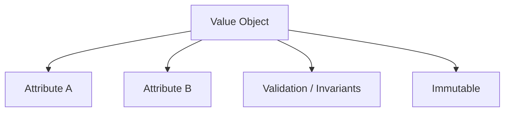
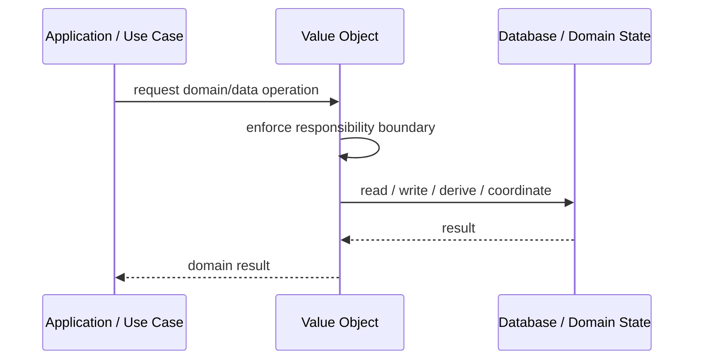
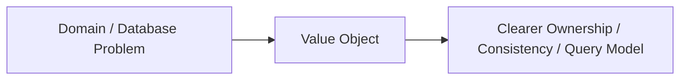

# Value Object

## Core Idea

A Value Object is defined by its attributes, has no identity, and is usually immutable.

---

## Problem It Solves

Important domain concepts are represented as primitive values, causing validation and meaning to spread everywhere.

---

## 3 Concrete Examples

### Example 1: Money

Amount and currency are kept together and validated as one concept.

### Example 2: Address

Street, city, state, and postal code form a value object.

### Example 3: DateRange

Start and end dates are validated together.

---

## Architect Questions

- Is this object defined by value rather than identity?
- Should it be immutable?
- What validation belongs inside it?
- Can it replace primitive obsession?
- How is equality determined?
- Should it be embedded inside an entity or aggregate?

---

## Main Diagram



---

## Runtime / Responsibility Flow



---

## Implementation Shape

```txt
1. Identify the domain or persistence problem.
2. Define the ownership boundary: entity, aggregate, repository, table, tenant, shard, view, or event stream.
3. Define invariants and consistency requirements.
4. Define how data is loaded, changed, saved, queried, and audited.
5. Define transaction behavior and failure behavior.
6. Add tests around business rules, persistence mapping, concurrency, and edge cases.
7. Keep the pattern focused. Do not use database patterns to hide unclear domain modeling.
```

---

## When to Use

- The concept is defined by values, not identity.
- Immutability and validation are useful.
- You want to remove primitive obsession.

---

## When Not to Use

- Identity matters.
- The object must be heavily mutable.
- It is only a thin wrapper with no meaning or validation.

---

## Common Smell That Suggests This Pattern

```txt
Business rules, persistence logic, identity, history, or query needs are becoming unclear,
duplicated,
too coupled to database details,
or too slow for the current model.
```

---

## Common Mistakes

```txt
Confusing database tables with domain concepts.

Adding abstractions that only pass calls through.

Letting persistence concerns dominate the domain model.

Ignoring transaction boundaries.

Ignoring concurrency and stale data.

Using a complex DDD pattern for simple CRUD.

Using simple CRUD patterns for a complex domain.
```

---

## Best Visual Summary



## Final Meaning

Value Object is useful when it protects business meaning, data consistency, query performance, or persistence boundaries. If the problem is simple CRUD, do not overcomplicate it.
