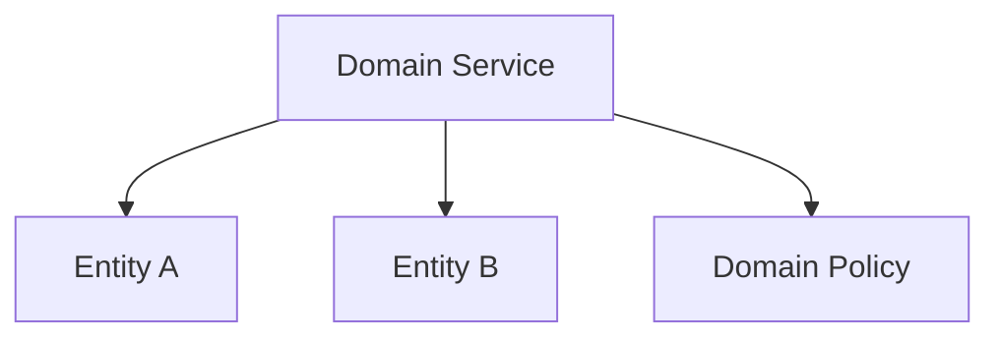
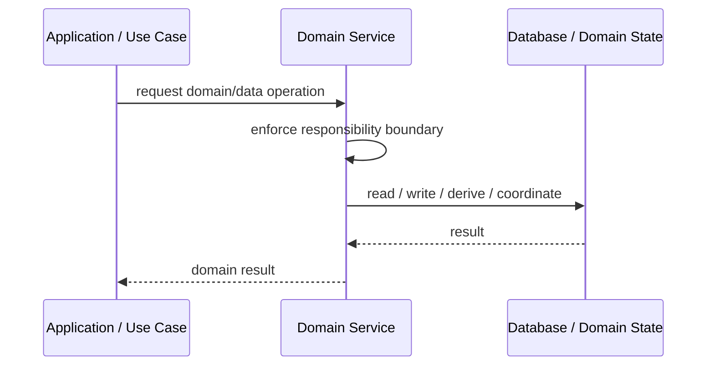
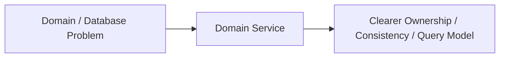

# Domain Service

## Core Idea

A Domain Service holds domain logic that does not naturally belong inside a single entity or value object.

---

## Problem It Solves

Some business operations involve multiple domain objects and do not fit cleanly inside one object.

---

## 3 Concrete Examples

### Example 1: Funds Transfer Service

Coordinates business rules between two bank accounts.

### Example 2: Pricing Service

Calculates price using product, customer, promotion, and tax rules.

### Example 3: Eligibility Service

Determines loan eligibility using applicant, credit profile, and policy.

---

## Architect Questions

- Is this truly domain logic, not application orchestration?
- Why does this behavior not belong on an entity?
- Which domain objects participate?
- Is the service stateless?
- Does it express business language?
- Is it becoming a dumping ground?

---

## Main Diagram



---

## Runtime / Responsibility Flow



---

## Implementation Shape

```txt
1. Identify the domain or persistence problem.
2. Define the ownership boundary: entity, aggregate, repository, table, tenant, shard, view, or event stream.
3. Define invariants and consistency requirements.
4. Define how data is loaded, changed, saved, queried, and audited.
5. Define transaction behavior and failure behavior.
6. Add tests around business rules, persistence mapping, concurrency, and edge cases.
7. Keep the pattern focused. Do not use database patterns to hide unclear domain modeling.
```

---

## When to Use

- Domain behavior spans multiple objects.
- The operation is business logic, not infrastructure.
- The behavior does not belong naturally on one entity.

---

## When Not to Use

- The logic belongs on an entity.
- It is application orchestration, not domain logic.
- It becomes a dumping ground for all business rules.

---

## Common Smell That Suggests This Pattern

```txt
Business rules, persistence logic, identity, history, or query needs are becoming unclear,
duplicated,
too coupled to database details,
or too slow for the current model.
```

---

## Common Mistakes

```txt
Confusing database tables with domain concepts.

Adding abstractions that only pass calls through.

Letting persistence concerns dominate the domain model.

Ignoring transaction boundaries.

Ignoring concurrency and stale data.

Using a complex DDD pattern for simple CRUD.

Using simple CRUD patterns for a complex domain.
```

---

## Best Visual Summary



## Final Meaning

Domain Service is useful when it protects business meaning, data consistency, query performance, or persistence boundaries. If the problem is simple CRUD, do not overcomplicate it.
