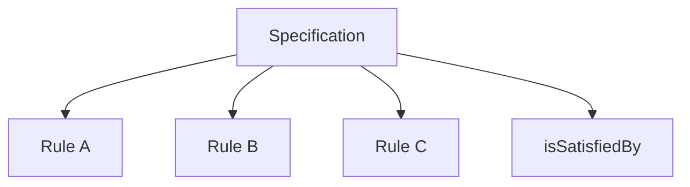
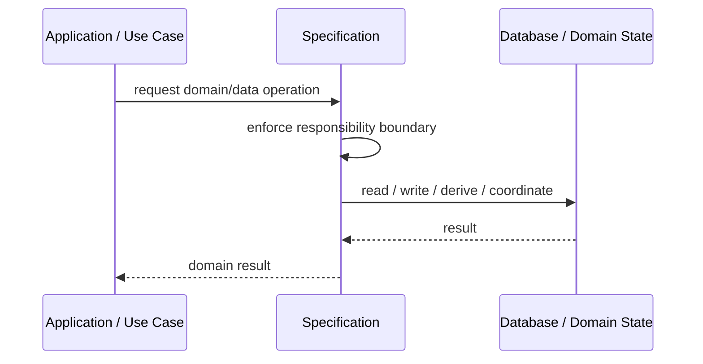
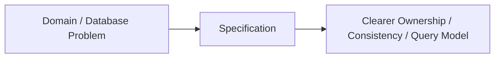

# Specification

## Core Idea

Specification encapsulates a business rule or query predicate so it can be reused, combined, and tested.

---

## Problem It Solves

Business rules such as eligibility, filtering, and validation are duplicated across services and queries.

---

## 3 Concrete Examples

### Example 1: EligibleForDiscount

A customer must be active, have loyalty status, and meet order total rules.

### Example 2: ProductIsSellable

A product must be active, in stock, and not discontinued.

### Example 3: LoanApprovalSpecification

Applicant must satisfy income, credit, and debt rules.

---

## Architect Questions

- What business rule needs to be named and reused?
- Can the rule be evaluated in memory, database, or both?
- Can specifications be composed with AND/OR/NOT?
- Is this validation, query filtering, or policy?
- Who owns the rule?
- Will over-abstracting make the rule harder to read?

---

## Main Diagram



---

## Runtime / Responsibility Flow



---

## Implementation Shape

```txt
1. Identify the domain or persistence problem.
2. Define the ownership boundary: entity, aggregate, repository, table, tenant, shard, view, or event stream.
3. Define invariants and consistency requirements.
4. Define how data is loaded, changed, saved, queried, and audited.
5. Define transaction behavior and failure behavior.
6. Add tests around business rules, persistence mapping, concurrency, and edge cases.
7. Keep the pattern focused. Do not use database patterns to hide unclear domain modeling.
```

---

## When to Use

- Business rules need names and reuse.
- Filtering or eligibility rules are duplicated.
- Rules need composition or testing.

---

## When Not to Use

- The rule is used once and is simple.
- The abstraction makes the rule harder to read.
- Database translation is impossible but required.

---

## Common Smell That Suggests This Pattern

```txt
Business rules, persistence logic, identity, history, or query needs are becoming unclear,
duplicated,
too coupled to database details,
or too slow for the current model.
```

---

## Common Mistakes

```txt
Confusing database tables with domain concepts.

Adding abstractions that only pass calls through.

Letting persistence concerns dominate the domain model.

Ignoring transaction boundaries.

Ignoring concurrency and stale data.

Using a complex DDD pattern for simple CRUD.

Using simple CRUD patterns for a complex domain.
```

---

## Best Visual Summary



## Final Meaning

Specification is useful when it protects business meaning, data consistency, query performance, or persistence boundaries. If the problem is simple CRUD, do not overcomplicate it.
