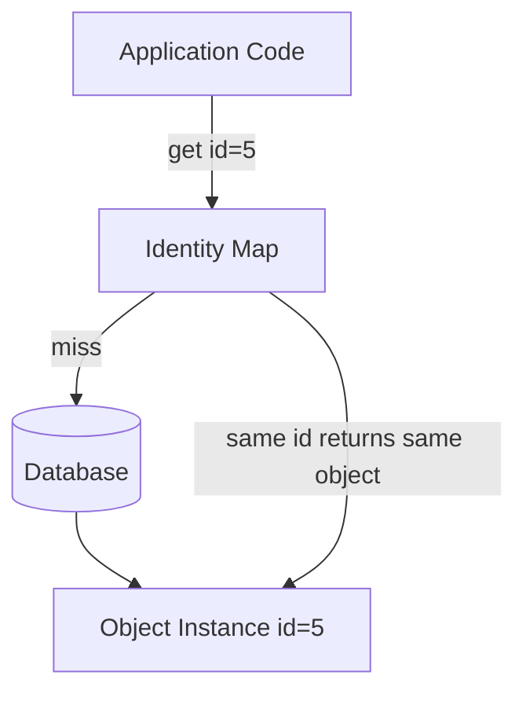
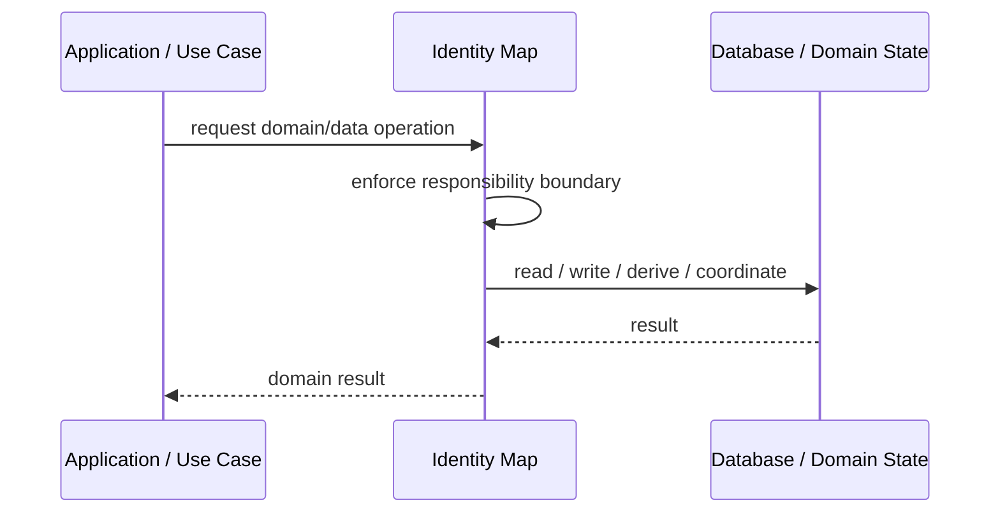
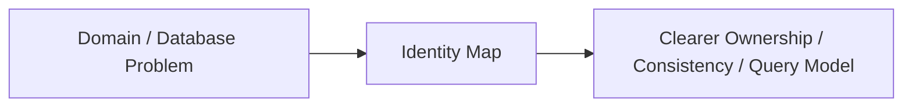

# Identity Map

## Core Idea

Identity Map ensures only one in-memory object instance exists for a given database identity within a session or unit of work.

---

## Problem It Solves

The same record can be loaded multiple times into different objects, causing inconsistent changes.

---

## 3 Concrete Examples

### Example 1: Customer Session Cache

Loading Customer #5 twice returns the same object instance.

### Example 2: Order Graph Loading

Several order lines reference the same product object from the identity map.

### Example 3: ORM Tracking

An ORM tracks loaded entities to prevent duplicate instances.

---

## Architect Questions

- What scope owns the identity map?
- What key identifies objects?
- How are objects added and retrieved?
- How does it interact with Unit of Work?
- When is the map cleared?
- Can stale objects become a problem?

---

## Main Diagram



---

## Runtime / Responsibility Flow



---

## Implementation Shape

```txt
1. Identify the domain or persistence problem.
2. Define the ownership boundary: entity, aggregate, repository, table, tenant, shard, view, or event stream.
3. Define invariants and consistency requirements.
4. Define how data is loaded, changed, saved, queried, and audited.
5. Define transaction behavior and failure behavior.
6. Add tests around business rules, persistence mapping, concurrency, and edge cases.
7. Keep the pattern focused. Do not use database patterns to hide unclear domain modeling.
```

---

## When to Use

- The same object may be loaded multiple times in one session.
- You need object identity consistency in memory.
- Unit of Work or ORM tracking is used.

---

## When Not to Use

- Objects are stateless DTOs.
- The scope is too long and stale data is likely.
- The ORM already handles it invisibly.

---

## Common Smell That Suggests This Pattern

```txt
Business rules, persistence logic, identity, history, or query needs are becoming unclear,
duplicated,
too coupled to database details,
or too slow for the current model.
```

---

## Common Mistakes

```txt
Confusing database tables with domain concepts.

Adding abstractions that only pass calls through.

Letting persistence concerns dominate the domain model.

Ignoring transaction boundaries.

Ignoring concurrency and stale data.

Using a complex DDD pattern for simple CRUD.

Using simple CRUD patterns for a complex domain.
```

---

## Best Visual Summary



## Final Meaning

Identity Map is useful when it protects business meaning, data consistency, query performance, or persistence boundaries. If the problem is simple CRUD, do not overcomplicate it.
