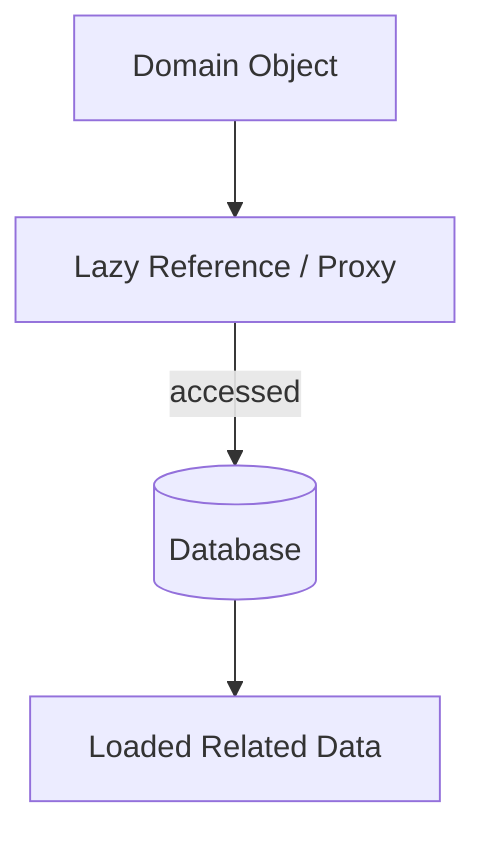
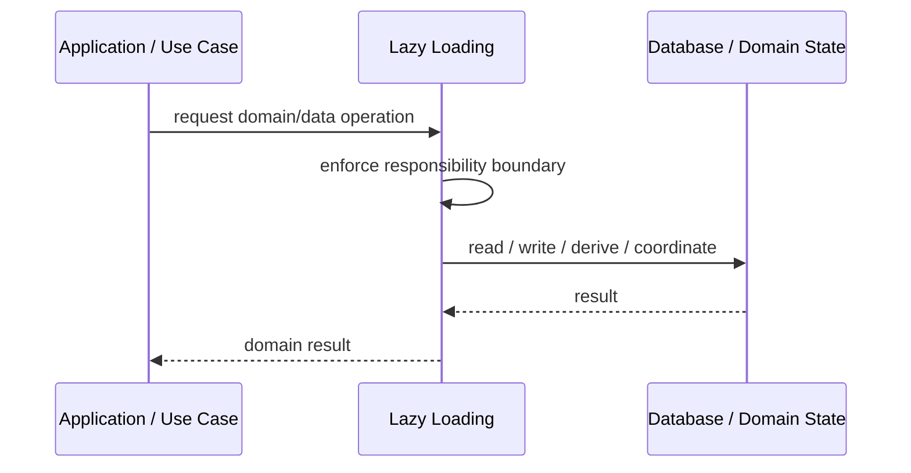
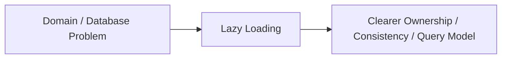

# Lazy Loading

## Core Idea

Lazy Loading delays loading data until it is actually needed.

---

## Problem It Solves

Loading entire object graphs upfront can waste memory, time, and database calls.

---

## 3 Concrete Examples

### Example 1: Customer Orders

Customer is loaded first; orders are loaded only when accessed.

### Example 2: Product Images

Product metadata loads immediately, large images load later.

### Example 3: Document Attachments

Document record loads first; attachment binary loads on demand.

---

## Architect Questions

- Which data is expensive and optional?
- When is the data actually needed?
- Will lazy loading cause N+1 query problems?
- Can the caller tell when database access happens?
- Is eager loading better for this use case?
- How is lazy loading handled outside a database session?

---

## Main Diagram



---

## Runtime / Responsibility Flow



---

## Implementation Shape

```txt
1. Identify the domain or persistence problem.
2. Define the ownership boundary: entity, aggregate, repository, table, tenant, shard, view, or event stream.
3. Define invariants and consistency requirements.
4. Define how data is loaded, changed, saved, queried, and audited.
5. Define transaction behavior and failure behavior.
6. Add tests around business rules, persistence mapping, concurrency, and edge cases.
7. Keep the pattern focused. Do not use database patterns to hide unclear domain modeling.
```

---

## When to Use

- Related data is expensive and not always needed.
- Initial load should be fast.
- Optional object graph loading makes sense.

---

## When Not to Use

- It creates N+1 query problems.
- Database access must be explicit.
- The session may be closed before data access.

---

## Common Smell That Suggests This Pattern

```txt
Business rules, persistence logic, identity, history, or query needs are becoming unclear,
duplicated,
too coupled to database details,
or too slow for the current model.
```

---

## Common Mistakes

```txt
Confusing database tables with domain concepts.

Adding abstractions that only pass calls through.

Letting persistence concerns dominate the domain model.

Ignoring transaction boundaries.

Ignoring concurrency and stale data.

Using a complex DDD pattern for simple CRUD.

Using simple CRUD patterns for a complex domain.
```

---

## Best Visual Summary



## Final Meaning

Lazy Loading is useful when it protects business meaning, data consistency, query performance, or persistence boundaries. If the problem is simple CRUD, do not overcomplicate it.
