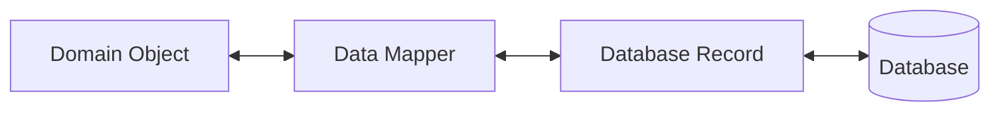
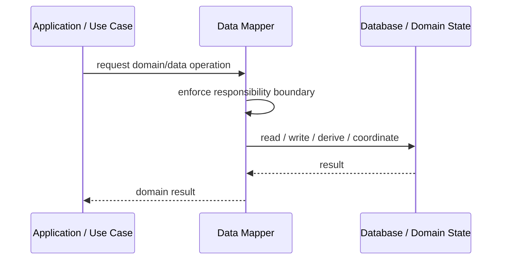

# Data Mapper

## Core Idea

Data Mapper moves data between domain objects and database records while keeping domain objects independent of persistence details.

---

## Problem It Solves

Domain objects become polluted with SQL, ORM metadata, persistence methods, or database schema concerns.

---

## 3 Concrete Examples

### Example 1: Order Mapper

Maps order rows and order_line rows into an Order aggregate.

### Example 2: Customer Mapper

Maps database customer records into clean Customer domain objects.

### Example 3: Invoice Mapper

Converts between invoice domain model and relational tables.

---

## Architect Questions

- What domain object maps to what database structure?
- Should mapping be manual or ORM-supported?
- How are relationships handled?
- Where does validation belong?
- Can domain objects stay persistence-ignorant?
- Is Active Record simpler for this case?

---

## Main Diagram



---

## Runtime / Responsibility Flow



---

## Implementation Shape

```txt
1. Identify the domain or persistence problem.
2. Define the ownership boundary: entity, aggregate, repository, table, tenant, shard, view, or event stream.
3. Define invariants and consistency requirements.
4. Define how data is loaded, changed, saved, queried, and audited.
5. Define transaction behavior and failure behavior.
6. Add tests around business rules, persistence mapping, concurrency, and edge cases.
7. Keep the pattern focused. Do not use database patterns to hide unclear domain modeling.
```

---

## When to Use

- Domain objects should stay persistence-ignorant.
- Database schema differs from domain model.
- Business rules should not depend on ORM models.

---

## When Not to Use

- The app is simple CRUD.
- The database model and domain model are identical.
- Active Record is enough and faster to deliver.

---

## Common Smell That Suggests This Pattern

```txt
Business rules, persistence logic, identity, history, or query needs are becoming unclear,
duplicated,
too coupled to database details,
or too slow for the current model.
```

---

## Common Mistakes

```txt
Confusing database tables with domain concepts.

Adding abstractions that only pass calls through.

Letting persistence concerns dominate the domain model.

Ignoring transaction boundaries.

Ignoring concurrency and stale data.

Using a complex DDD pattern for simple CRUD.

Using simple CRUD patterns for a complex domain.
```

---

## Best Visual Summary


## Final Meaning

Data Mapper is useful when it protects business meaning, data consistency, query performance, or persistence boundaries. If the problem is simple CRUD, do not overcomplicate it.
