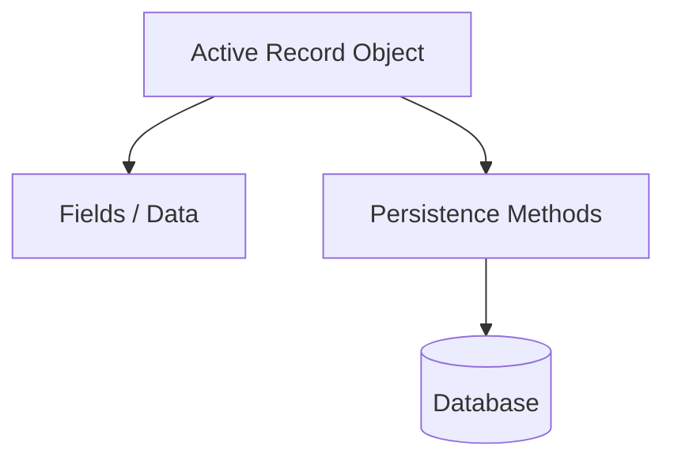
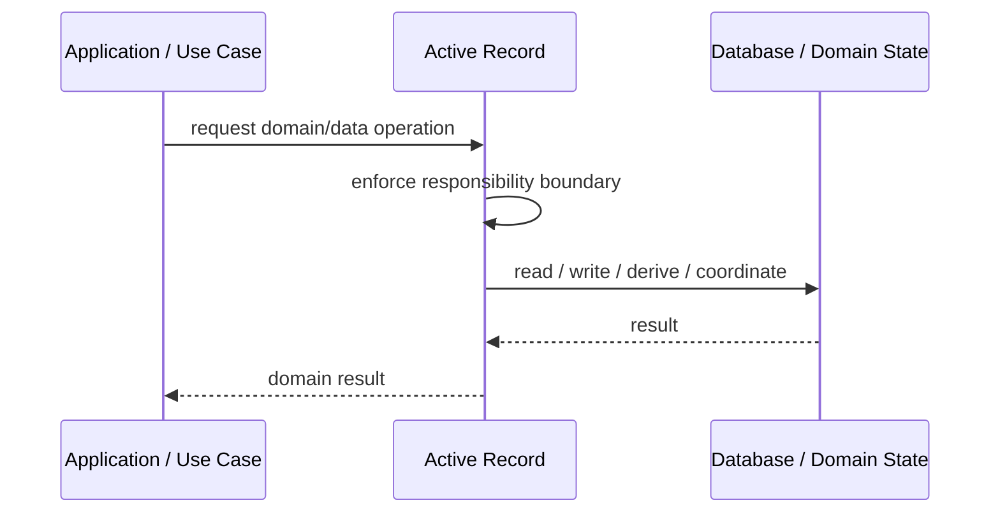
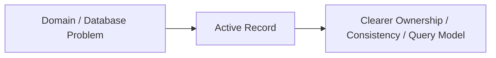

# Active Record

## Core Idea

Active Record combines domain data and persistence operations in the same object.

---

## Problem It Solves

Simple database-backed objects need straightforward CRUD behavior without a separate mapper layer.

---

## 3 Concrete Examples

### Example 1: User Active Record

User.find(id), user.save(), and user.delete() live on the User model.

### Example 2: Blog Post Model

Post object contains fields and persistence methods.

### Example 3: Admin CRUD Table

A simple Product model maps directly to a products table.

---

## Architect Questions

- Is the domain simple enough for persistence and behavior to live together?
- Does the object map closely to one table?
- Will business rules become complex?
- Is testability acceptable?
- Does the framework encourage Active Record?
- Would Data Mapper better protect the domain?

---

## Main Diagram



---

## Runtime / Responsibility Flow



---

## Implementation Shape

```txt
1. Identify the domain or persistence problem.
2. Define the ownership boundary: entity, aggregate, repository, table, tenant, shard, view, or event stream.
3. Define invariants and consistency requirements.
4. Define how data is loaded, changed, saved, queried, and audited.
5. Define transaction behavior and failure behavior.
6. Add tests around business rules, persistence mapping, concurrency, and edge cases.
7. Keep the pattern focused. Do not use database patterns to hide unclear domain modeling.
```

---

## When to Use

- The domain is simple.
- Objects map closely to database tables.
- The framework favors Active Record and speed matters.

---

## When Not to Use

- Business rules are complex.
- Domain must be persistence-independent.
- The model becomes bloated with database and business logic mixed.

---

## Common Smell That Suggests This Pattern

```txt
Business rules, persistence logic, identity, history, or query needs are becoming unclear,
duplicated,
too coupled to database details,
or too slow for the current model.
```

---

## Common Mistakes

```txt
Confusing database tables with domain concepts.

Adding abstractions that only pass calls through.

Letting persistence concerns dominate the domain model.

Ignoring transaction boundaries.

Ignoring concurrency and stale data.

Using a complex DDD pattern for simple CRUD.

Using simple CRUD patterns for a complex domain.
```

---

## Best Visual Summary



## Final Meaning

Active Record is useful when it protects business meaning, data consistency, query performance, or persistence boundaries. If the problem is simple CRUD, do not overcomplicate it.
