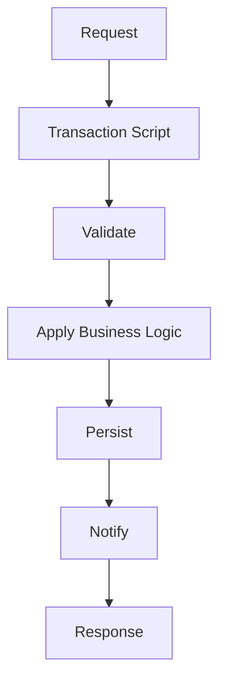
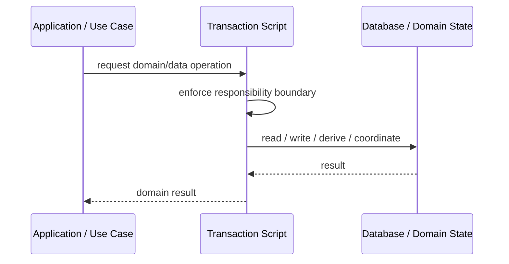
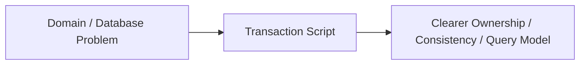

# Transaction Script

## Core Idea

Transaction Script organizes business logic as procedural scripts, one per use case or transaction.

---

## Problem It Solves

A simple application needs straightforward business workflows without complex domain object modeling.

---

## 3 Concrete Examples

### Example 1: Create Invoice Script

Validate request, calculate total, save invoice, send email.

### Example 2: Approve Time-Off Script

Check balance, mark request approved, notify employee.

### Example 3: Refund Order Script

Check refund rules, call payment provider, update order status.

---

## Architect Questions

- Is the business logic simple and procedural?
- Does each use case fit in one clear script?
- Will duplicated rules become a problem?
- Would a domain model be overkill?
- How are transactions handled?
- Can scripts stay readable as complexity grows?

---

## Main Diagram



---

## Runtime / Responsibility Flow



---

## Implementation Shape

```txt
1. Identify the domain or persistence problem.
2. Define the ownership boundary: entity, aggregate, repository, table, tenant, shard, view, or event stream.
3. Define invariants and consistency requirements.
4. Define how data is loaded, changed, saved, queried, and audited.
5. Define transaction behavior and failure behavior.
6. Add tests around business rules, persistence mapping, concurrency, and edge cases.
7. Keep the pattern focused. Do not use database patterns to hide unclear domain modeling.
```

---

## When to Use

- Business logic is simple and procedural.
- Each use case is clear and independent.
- A full domain model would be overkill.

---

## When Not to Use

- Rules are complex and shared.
- Scripts duplicate business policy.
- A rich domain model is needed.

---

## Common Smell That Suggests This Pattern

```txt
Business rules, persistence logic, identity, history, or query needs are becoming unclear,
duplicated,
too coupled to database details,
or too slow for the current model.
```

---

## Common Mistakes

```txt
Confusing database tables with domain concepts.

Adding abstractions that only pass calls through.

Letting persistence concerns dominate the domain model.

Ignoring transaction boundaries.

Ignoring concurrency and stale data.

Using a complex DDD pattern for simple CRUD.

Using simple CRUD patterns for a complex domain.
```

---

## Best Visual Summary



## Final Meaning

Transaction Script is useful when it protects business meaning, data consistency, query performance, or persistence boundaries. If the problem is simple CRUD, do not overcomplicate it.
