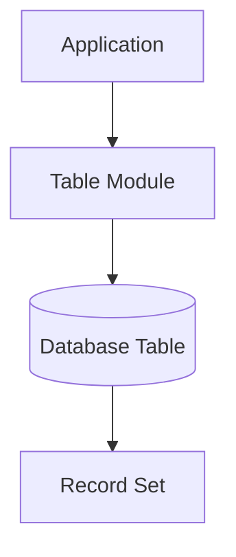
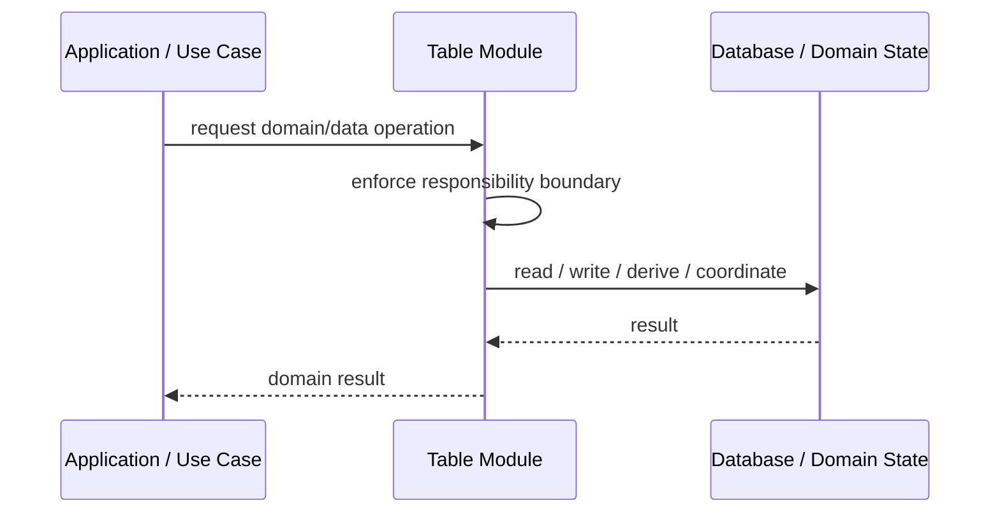
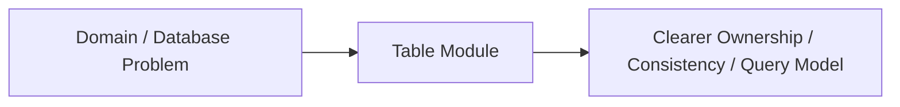

# Table Module

## Core Idea

Table Module organizes business logic around database tables rather than individual domain objects.

---

## Problem It Solves

Business logic operates naturally on sets of records, but a full object model is unnecessary.

---

## 3 Concrete Examples

### Example 1: Payroll Table Module

Payroll logic processes employee rows as a set.

### Example 2: Inventory Table Module

Inventory adjustments operate on product stock records.

### Example 3: Invoice Table Module

Invoice calculations operate on invoice and line tables.

---

## Architect Questions

- Does the logic operate on table-like record sets?
- Is an object-per-row model unnecessary?
- Can table-level services hold the behavior clearly?
- Does this fit the database-centric application style?
- Will the module become a god table service?
- Would Domain Model be better for complex behavior?

---

## Main Diagram



---

## Runtime / Responsibility Flow



---

## Implementation Shape

```txt
1. Identify the domain or persistence problem.
2. Define the ownership boundary: entity, aggregate, repository, table, tenant, shard, view, or event stream.
3. Define invariants and consistency requirements.
4. Define how data is loaded, changed, saved, queried, and audited.
5. Define transaction behavior and failure behavior.
6. Add tests around business rules, persistence mapping, concurrency, and edge cases.
7. Keep the pattern focused. Do not use database patterns to hide unclear domain modeling.
```

---

## When to Use

- Logic naturally operates on table-like record sets.
- The app is database-centric.
- A row-object domain model is unnecessary.

---

## When Not to Use

- Behavior is object-centric, not table-centric.
- Domain concepts have complex lifecycles.
- It becomes a god service per table.

---

## Common Smell That Suggests This Pattern

```txt
Business rules, persistence logic, identity, history, or query needs are becoming unclear,
duplicated,
too coupled to database details,
or too slow for the current model.
```

---

## Common Mistakes

```txt
Confusing database tables with domain concepts.

Adding abstractions that only pass calls through.

Letting persistence concerns dominate the domain model.

Ignoring transaction boundaries.

Ignoring concurrency and stale data.

Using a complex DDD pattern for simple CRUD.

Using simple CRUD patterns for a complex domain.
```

---

## Best Visual Summary



## Final Meaning

Table Module is useful when it protects business meaning, data consistency, query performance, or persistence boundaries. If the problem is simple CRUD, do not overcomplicate it.
