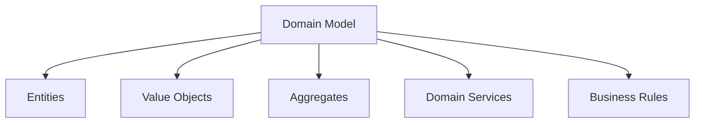
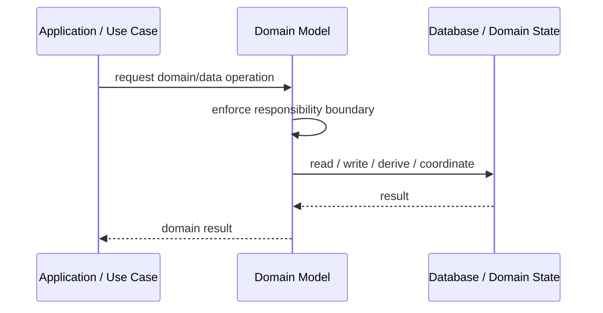
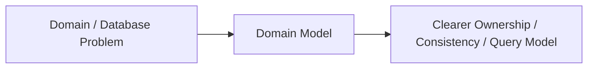

# Domain Model

## Core Idea

Domain Model represents business concepts, rules, and behavior as rich objects.

---

## Problem It Solves

Business logic is complex and becomes hard to manage as procedural scripts or database-centric code.

---

## 3 Concrete Examples

### Example 1: Insurance Policy Model

Policy, claim, coverage, and deductible objects enforce business rules.

### Example 2: Banking Account Model

Account and transaction objects protect balance invariants.

### Example 3: Subscription Billing Model

Subscription, plan, invoice, and renewal objects model billing behavior.

---

## Architect Questions

- Is the domain complex enough to justify rich objects?
- What are the core business concepts?
- What invariants must objects protect?
- Where do entities, value objects, aggregates, and services belong?
- Can business rules be tested without infrastructure?
- How is persistence kept from dominating the model?

---

## Main Diagram



---

## Runtime / Responsibility Flow



---

## Implementation Shape

```txt
1. Identify the domain or persistence problem.
2. Define the ownership boundary: entity, aggregate, repository, table, tenant, shard, view, or event stream.
3. Define invariants and consistency requirements.
4. Define how data is loaded, changed, saved, queried, and audited.
5. Define transaction behavior and failure behavior.
6. Add tests around business rules, persistence mapping, concurrency, and edge cases.
7. Keep the pattern focused. Do not use database patterns to hide unclear domain modeling.
```

---

## When to Use

- Business rules are complex.
- Domain concepts deserve rich behavior.
- You want business logic testable outside infrastructure.

---

## When Not to Use

- The app is simple CRUD.
- The team will build anemic objects with all logic elsewhere.
- The modeling cost is not justified.

---

## Common Smell That Suggests This Pattern

```txt
Business rules, persistence logic, identity, history, or query needs are becoming unclear,
duplicated,
too coupled to database details,
or too slow for the current model.
```

---

## Common Mistakes

```txt
Confusing database tables with domain concepts.

Adding abstractions that only pass calls through.

Letting persistence concerns dominate the domain model.

Ignoring transaction boundaries.

Ignoring concurrency and stale data.

Using a complex DDD pattern for simple CRUD.

Using simple CRUD patterns for a complex domain.
```

---

## Best Visual Summary



## Final Meaning

Domain Model is useful when it protects business meaning, data consistency, query performance, or persistence boundaries. If the problem is simple CRUD, do not overcomplicate it.
