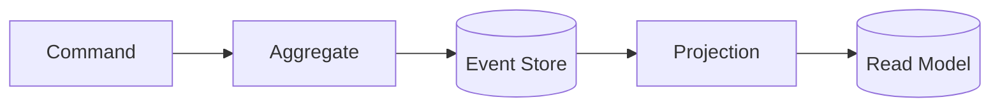
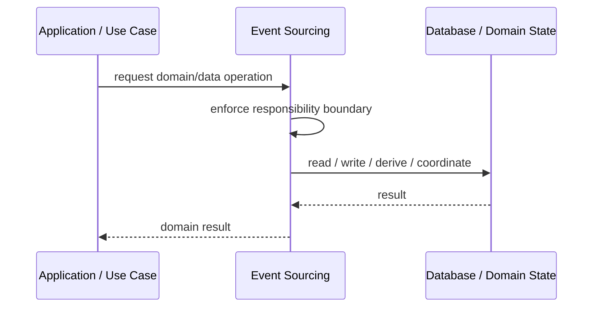
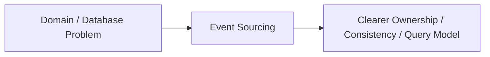

# Event Sourcing

## Core Idea

Event Sourcing stores state changes as a sequence of events and reconstructs current state by replaying those events.

---

## Problem It Solves

The system needs full history, auditability, replay, or temporal reconstruction instead of only current state.

---

## 3 Concrete Examples

### Example 1: Bank Ledger

Deposits, withdrawals, and transfers are stored as events.

### Example 2: Order Lifecycle

OrderCreated, PaymentAuthorized, Shipped, and Cancelled events define order state.

### Example 3: Collaboration Document

Every edit operation is stored and can be replayed.

---

## Architect Questions

- What are the business events?
- Can current state be derived from events?
- How are event schemas versioned?
- Are snapshots needed?
- How are projections built?
- Can the team handle replay and event evolution?

---

## Main Diagram



---

## Runtime / Responsibility Flow



---

## Implementation Shape

```txt
1. Identify the domain or persistence problem.
2. Define the ownership boundary: entity, aggregate, repository, table, tenant, shard, view, or event stream.
3. Define invariants and consistency requirements.
4. Define how data is loaded, changed, saved, queried, and audited.
5. Define transaction behavior and failure behavior.
6. Add tests around business rules, persistence mapping, concurrency, and edge cases.
7. Keep the pattern focused. Do not use database patterns to hide unclear domain modeling.
```

---

## When to Use

- Full event history is required.
- State reconstruction and replay matter.
- Business events are first-class concepts.

---

## When Not to Use

- Only current state matters.
- Events are unclear.
- Replay and schema evolution complexity is not justified.

---

## Common Smell That Suggests This Pattern

```txt
Business rules, persistence logic, identity, history, or query needs are becoming unclear,
duplicated,
too coupled to database details,
or too slow for the current model.
```

---

## Common Mistakes

```txt
Confusing database tables with domain concepts.

Adding abstractions that only pass calls through.

Letting persistence concerns dominate the domain model.

Ignoring transaction boundaries.

Ignoring concurrency and stale data.

Using a complex DDD pattern for simple CRUD.

Using simple CRUD patterns for a complex domain.
```

---

## Best Visual Summary



## Final Meaning

Event Sourcing is useful when it protects business meaning, data consistency, query performance, or persistence boundaries. If the problem is simple CRUD, do not overcomplicate it.
