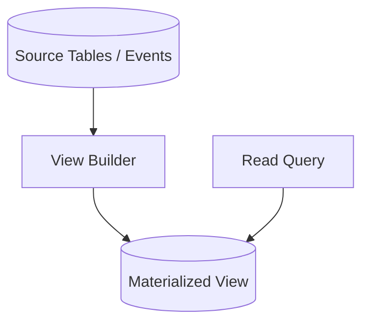
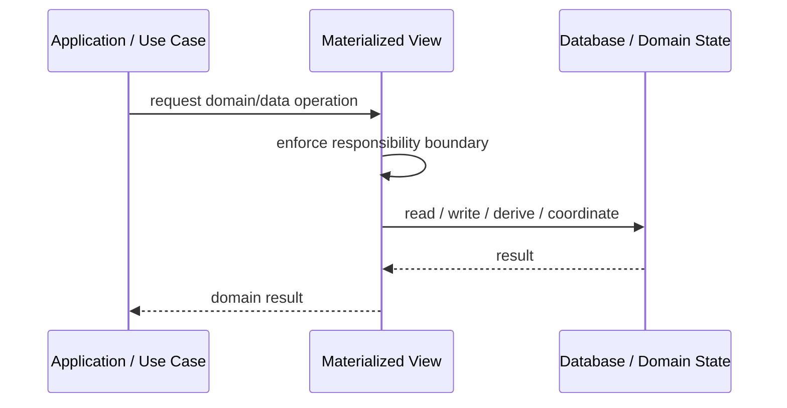

# Materialized View

## Core Idea

Materialized View stores precomputed query results so reads can be faster or simpler.

---

## Problem It Solves

Queries are expensive because they require joins, aggregation, transformation, or repeated computation.

---

## 3 Concrete Examples

### Example 1: Sales Dashboard View

Daily revenue totals are precomputed for dashboards.

### Example 2: Customer Summary View

Customer profile, order count, and balance are stored as one read view.

### Example 3: Inventory Availability View

Product availability is precomputed from stock, reservations, and warehouse data.

---

## Architect Questions

- What query is too expensive?
- How fresh must the view be?
- How is the view updated?
- Can stale data be tolerated?
- Who owns the view?
- How is rebuild handled?

---

## Main Diagram



---

## Runtime / Responsibility Flow



---

## Implementation Shape

```txt
1. Identify the domain or persistence problem.
2. Define the ownership boundary: entity, aggregate, repository, table, tenant, shard, view, or event stream.
3. Define invariants and consistency requirements.
4. Define how data is loaded, changed, saved, queried, and audited.
5. Define transaction behavior and failure behavior.
6. Add tests around business rules, persistence mapping, concurrency, and edge cases.
7. Keep the pattern focused. Do not use database patterns to hide unclear domain modeling.
```

---

## When to Use

- Queries are expensive.
- Read performance matters.
- Stale or asynchronously updated views are acceptable.

---

## When Not to Use

- Fresh data is mandatory.
- The query is already fast.
- View update/rebuild ownership is unclear.

---

## Common Smell That Suggests This Pattern

```txt
Business rules, persistence logic, identity, history, or query needs are becoming unclear,
duplicated,
too coupled to database details,
or too slow for the current model.
```

---

## Common Mistakes

```txt
Confusing database tables with domain concepts.

Adding abstractions that only pass calls through.

Letting persistence concerns dominate the domain model.

Ignoring transaction boundaries.

Ignoring concurrency and stale data.

Using a complex DDD pattern for simple CRUD.

Using simple CRUD patterns for a complex domain.
```

---

## Best Visual Summary


## Final Meaning

Materialized View is useful when it protects business meaning, data consistency, query performance, or persistence boundaries. If the problem is simple CRUD, do not overcomplicate it.
