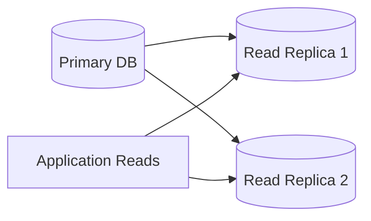
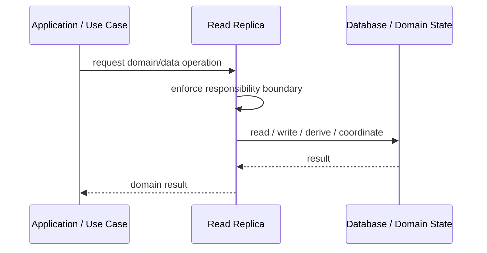
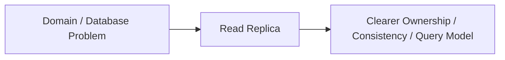

# Read Replica

## Core Idea

Read Replica copies data from a primary database to one or more replicas used for read traffic.

---

## Problem It Solves

Read workload is overloading the primary database or needs geographic/local read scaling.

---

## 3 Concrete Examples

### Example 1: Reporting Replica

Reports query a replica so operational writes are not slowed down.

### Example 2: Web Read Scaling

Product pages read from replicas while writes go to primary.

### Example 3: Regional Replica

Users in another region read from a nearby replica.

---

## Architect Questions

- Can reads tolerate replication lag?
- Which queries should use replicas?
- How is failover handled?
- How stale can replica data be?
- How are read-after-write expectations handled?
- How is replica health monitored?

---

## Main Diagram



---

## Runtime / Responsibility Flow



---

## Implementation Shape

```txt
1. Identify the domain or persistence problem.
2. Define the ownership boundary: entity, aggregate, repository, table, tenant, shard, view, or event stream.
3. Define invariants and consistency requirements.
4. Define how data is loaded, changed, saved, queried, and audited.
5. Define transaction behavior and failure behavior.
6. Add tests around business rules, persistence mapping, concurrency, and edge cases.
7. Keep the pattern focused. Do not use database patterns to hide unclear domain modeling.
```

---

## When to Use

- Read traffic is high.
- Reads can tolerate lag.
- You need reporting or regional read scaling.

---

## When Not to Use

- Reads must always reflect latest writes.
- Replication lag is unacceptable.
- Operational complexity is not justified.

---

## Common Smell That Suggests This Pattern

```txt
Business rules, persistence logic, identity, history, or query needs are becoming unclear,
duplicated,
too coupled to database details,
or too slow for the current model.
```

---

## Common Mistakes

```txt
Confusing database tables with domain concepts.

Adding abstractions that only pass calls through.

Letting persistence concerns dominate the domain model.

Ignoring transaction boundaries.

Ignoring concurrency and stale data.

Using a complex DDD pattern for simple CRUD.

Using simple CRUD patterns for a complex domain.
```

---

## Best Visual Summary



## Final Meaning

Read Replica is useful when it protects business meaning, data consistency, query performance, or persistence boundaries. If the problem is simple CRUD, do not overcomplicate it.
