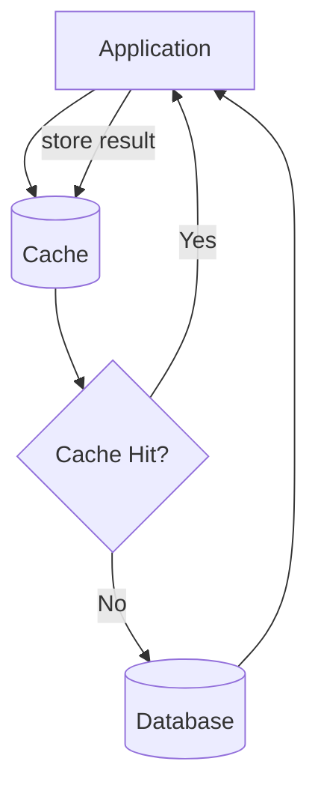
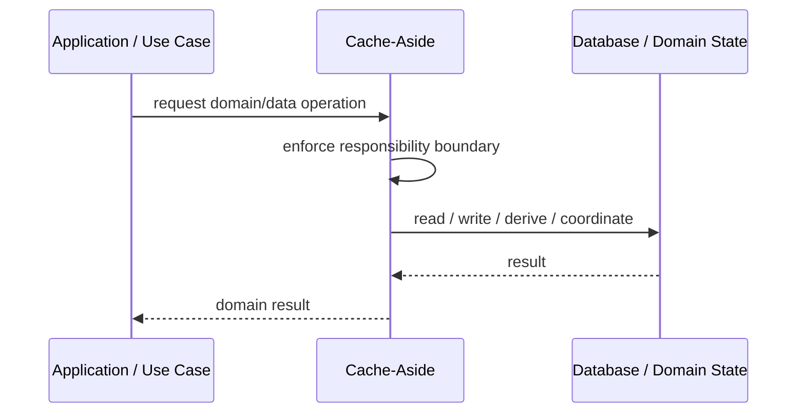
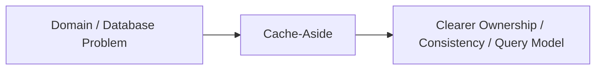

# Cache-Aside

## Core Idea

Cache-Aside lets the application check the cache first, load from the database on a miss, then store the result in cache.

---

## Problem It Solves

Repeated reads hit the database even when the same data could be reused from a cache.

---

## 3 Concrete Examples

### Example 1: Product Detail Cache

Product pages load product data from cache or fallback to DB.

### Example 2: User Profile Cache

Profile lookups are cached with TTL.

### Example 3: Configuration Cache

Application settings are cached and refreshed on miss or expiry.

---

## Architect Questions

- What data is safe to cache?
- What TTL should be used?
- How is cache invalidated?
- Can stale data be tolerated?
- What happens when cache is down?
- How is cache stampede prevented?

---

## Main Diagram



---

## Runtime / Responsibility Flow



---

## Implementation Shape

```txt
1. Identify the domain or persistence problem.
2. Define the ownership boundary: entity, aggregate, repository, table, tenant, shard, view, or event stream.
3. Define invariants and consistency requirements.
4. Define how data is loaded, changed, saved, queried, and audited.
5. Define transaction behavior and failure behavior.
6. Add tests around business rules, persistence mapping, concurrency, and edge cases.
7. Keep the pattern focused. Do not use database patterns to hide unclear domain modeling.
```

---

## When to Use

- Repeated reads are expensive.
- Stale data is acceptable within limits.
- Application-controlled caching is practical.

---

## When Not to Use

- Data changes constantly and must be fresh.
- Invalidation rules are unclear.
- Cache failure would break core behavior.

---

## Common Smell That Suggests This Pattern

```txt
Business rules, persistence logic, identity, history, or query needs are becoming unclear,
duplicated,
too coupled to database details,
or too slow for the current model.
```

---

## Common Mistakes

```txt
Confusing database tables with domain concepts.

Adding abstractions that only pass calls through.

Letting persistence concerns dominate the domain model.

Ignoring transaction boundaries.

Ignoring concurrency and stale data.

Using a complex DDD pattern for simple CRUD.

Using simple CRUD patterns for a complex domain.
```

---

## Best Visual Summary



## Final Meaning

Cache-Aside is useful when it protects business meaning, data consistency, query performance, or persistence boundaries. If the problem is simple CRUD, do not overcomplicate it.
