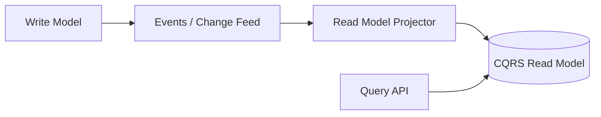
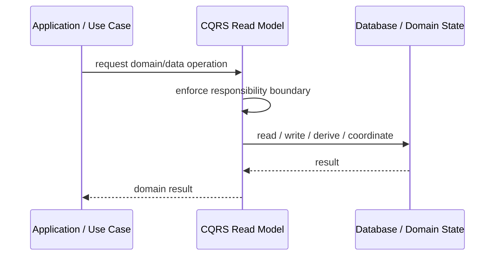
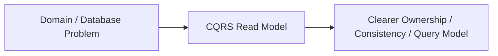

# CQRS Read Model

## Core Idea

CQRS Read Model is a read-optimized model built separately from the write model.

---

## Problem It Solves

The write model is good for enforcing rules but bad for fast, convenient, or complex queries.

---

## 3 Concrete Examples

### Example 1: Order Dashboard

A read model stores order status, customer name, total, and shipment status in one view.

### Example 2: Account Statement

A read projection stores transaction history optimized for display.

### Example 3: Product Search View

A denormalized read model supports search filters and sorting.

---

## Architect Questions

- What query needs a separate model?
- How is the read model updated?
- Can reads be eventually consistent?
- How is rebuild handled?
- Who owns projection logic?
- How are stale read models detected?

---

## Main Diagram



---

## Runtime / Responsibility Flow



---

## Implementation Shape

```txt
1. Identify the domain or persistence problem.
2. Define the ownership boundary: entity, aggregate, repository, table, tenant, shard, view, or event stream.
3. Define invariants and consistency requirements.
4. Define how data is loaded, changed, saved, queried, and audited.
5. Define transaction behavior and failure behavior.
6. Add tests around business rules, persistence mapping, concurrency, and edge cases.
7. Keep the pattern focused. Do not use database patterns to hide unclear domain modeling.
```

---

## When to Use

- Read needs differ from write model needs.
- Denormalized projections improve query performance.
- Eventual consistency is acceptable.

---

## When Not to Use

- Simple CRUD queries are enough.
- Eventual consistency is unacceptable.
- Projection rebuilds are not designed.

---

## Common Smell That Suggests This Pattern

```txt
Business rules, persistence logic, identity, history, or query needs are becoming unclear,
duplicated,
too coupled to database details,
or too slow for the current model.
```

---

## Common Mistakes

```txt
Confusing database tables with domain concepts.

Adding abstractions that only pass calls through.

Letting persistence concerns dominate the domain model.

Ignoring transaction boundaries.

Ignoring concurrency and stale data.

Using a complex DDD pattern for simple CRUD.

Using simple CRUD patterns for a complex domain.
```

---

## Best Visual Summary



## Final Meaning

CQRS Read Model is useful when it protects business meaning, data consistency, query performance, or persistence boundaries. If the problem is simple CRUD, do not overcomplicate it.
