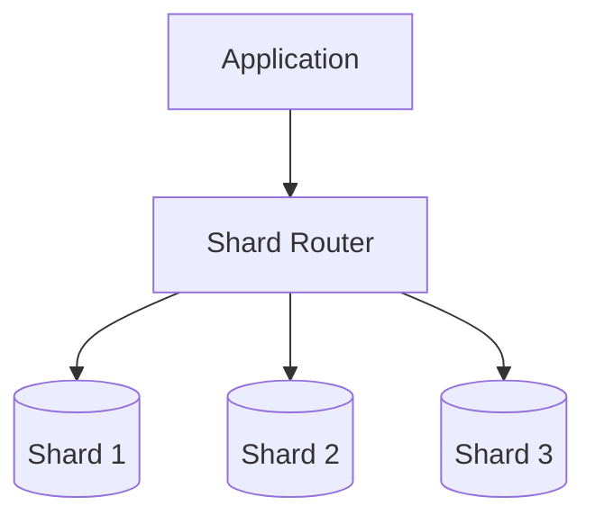
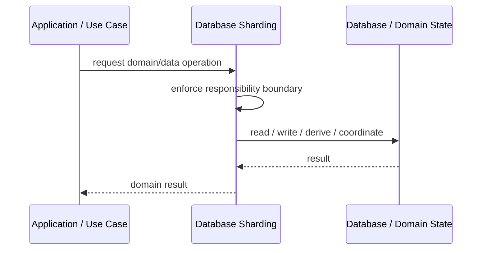
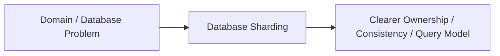

# Database Sharding

## Core Idea

Database Sharding splits data across multiple database shards using a shard key.

---

## Problem It Solves

One database cannot handle the data size, throughput, or tenant volume.

---

## 3 Concrete Examples

### Example 1: Customer ID Sharding

Customers are distributed by customer ID across shards.

### Example 2: Tenant Sharding

Tenant groups are assigned to different shards.

### Example 3: Region Sharding

Data is split by geographic region.

---

## Architect Questions

- What is the shard key?
- Does the key distribute data evenly?
- How are cross-shard queries handled?
- How is resharding done?
- How are transactions across shards avoided?
- How is shard routing implemented?

---

## Main Diagram



---

## Runtime / Responsibility Flow



---

## Implementation Shape

```txt
1. Identify the domain or persistence problem.
2. Define the ownership boundary: entity, aggregate, repository, table, tenant, shard, view, or event stream.
3. Define invariants and consistency requirements.
4. Define how data is loaded, changed, saved, queried, and audited.
5. Define transaction behavior and failure behavior.
6. Add tests around business rules, persistence mapping, concurrency, and edge cases.
7. Keep the pattern focused. Do not use database patterns to hide unclear domain modeling.
```

---

## When to Use

- One database cannot handle scale.
- A good shard key exists.
- Cross-shard operations are limited.

---

## When Not to Use

- A single database can still scale.
- Cross-shard joins are common.
- Shard key would create hotspots.

---

## Common Smell That Suggests This Pattern

```txt
Business rules, persistence logic, identity, history, or query needs are becoming unclear,
duplicated,
too coupled to database details,
or too slow for the current model.
```

---

## Common Mistakes

```txt
Confusing database tables with domain concepts.

Adding abstractions that only pass calls through.

Letting persistence concerns dominate the domain model.

Ignoring transaction boundaries.

Ignoring concurrency and stale data.

Using a complex DDD pattern for simple CRUD.

Using simple CRUD patterns for a complex domain.
```

---

## Best Visual Summary



## Final Meaning

Database Sharding is useful when it protects business meaning, data consistency, query performance, or persistence boundaries. If the problem is simple CRUD, do not overcomplicate it.
