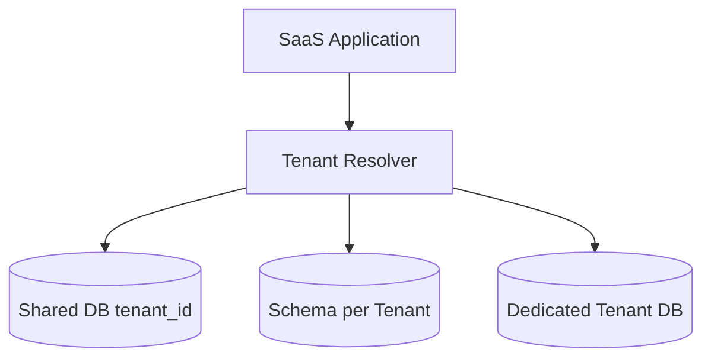
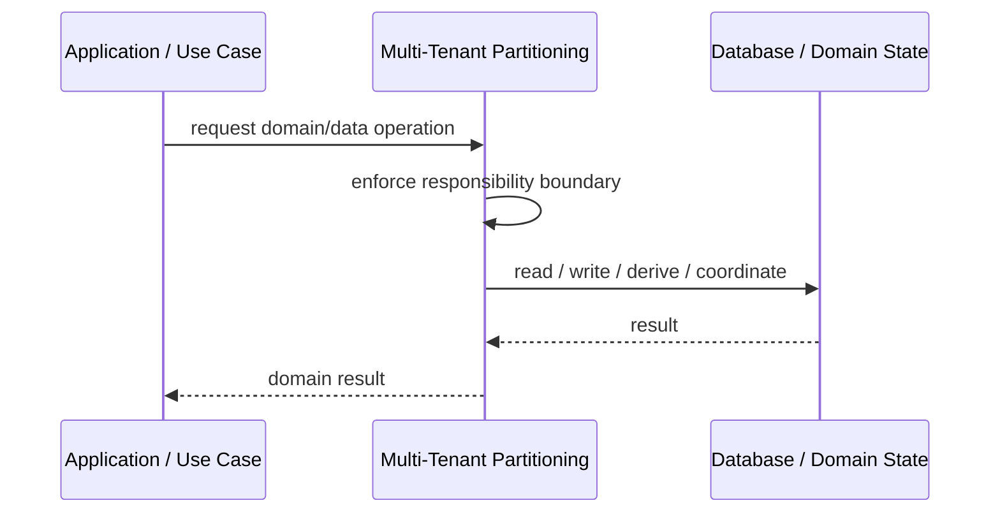
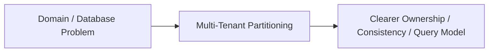

# Multi-Tenant Partitioning

## Core Idea

Multi-Tenant Partitioning separates tenant data logically or physically to support isolation, scaling, security, or cost control.

---

## Problem It Solves

A SaaS system must store data for many tenants while controlling isolation, performance, and operations.

---

## 3 Concrete Examples

### Example 1: Shared Table Tenant Column

All tenants share tables, with tenant_id partitioning rows.

### Example 2: Schema per Tenant

Each tenant gets separate database schema.

### Example 3: Database per Tenant

Large or regulated tenants get their own database.

---

## Architect Questions

- What isolation level does each tenant require?
- Is tenant_id enforced everywhere?
- Do some tenants need dedicated databases?
- How are migrations handled?
- How are noisy tenants isolated?
- How is tenant data exported or deleted?

---

## Main Diagram



---

## Runtime / Responsibility Flow



---

## Implementation Shape

```txt
1. Identify the domain or persistence problem.
2. Define the ownership boundary: entity, aggregate, repository, table, tenant, shard, view, or event stream.
3. Define invariants and consistency requirements.
4. Define how data is loaded, changed, saved, queried, and audited.
5. Define transaction behavior and failure behavior.
6. Add tests around business rules, persistence mapping, concurrency, and edge cases.
7. Keep the pattern focused. Do not use database patterns to hide unclear domain modeling.
```

---

## When to Use

- You run SaaS for many tenants.
- Tenant isolation and scaling matter.
- Tenant data ownership and lifecycle must be explicit.

---

## When Not to Use

- Single-tenant system.
- Tenant boundaries are unclear.
- Operational model cannot support chosen isolation level.

---

## Common Smell That Suggests This Pattern

```txt
Business rules, persistence logic, identity, history, or query needs are becoming unclear,
duplicated,
too coupled to database details,
or too slow for the current model.
```

---

## Common Mistakes

```txt
Confusing database tables with domain concepts.

Adding abstractions that only pass calls through.

Letting persistence concerns dominate the domain model.

Ignoring transaction boundaries.

Ignoring concurrency and stale data.

Using a complex DDD pattern for simple CRUD.

Using simple CRUD patterns for a complex domain.
```

---

## Best Visual Summary



## Final Meaning

Multi-Tenant Partitioning is useful when it protects business meaning, data consistency, query performance, or persistence boundaries. If the problem is simple CRUD, do not overcomplicate it.
