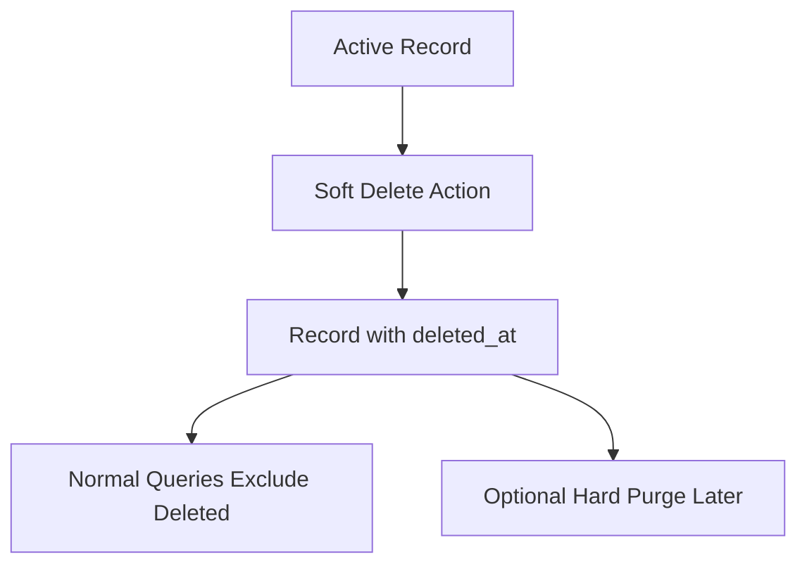
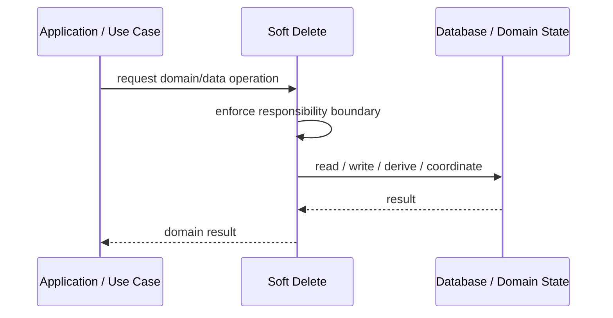
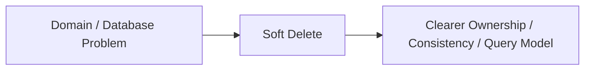

# Soft Delete

## Core Idea

Soft Delete marks records as deleted instead of physically removing them.

---

## Problem It Solves

Records need to disappear from normal use while remaining recoverable or auditable.

---

## 3 Concrete Examples

### Example 1: Deleted User Account

User is marked deleted_at but retained for audit and restore.

### Example 2: Archived Product

Product is hidden from catalog but kept for historical orders.

### Example 3: Removed Document

Document is marked deleted so it can be restored within retention period.

---

## Architect Questions

- Why must deleted data be retained?
- What column marks deletion?
- Should deleted records be restorable?
- How do queries exclude deleted records?
- What is the permanent purge policy?
- How does soft delete interact with unique constraints?

---

## Main Diagram



---

## Runtime / Responsibility Flow



---

## Implementation Shape

```txt
1. Identify the domain or persistence problem.
2. Define the ownership boundary: entity, aggregate, repository, table, tenant, shard, view, or event stream.
3. Define invariants and consistency requirements.
4. Define how data is loaded, changed, saved, queried, and audited.
5. Define transaction behavior and failure behavior.
6. Add tests around business rules, persistence mapping, concurrency, and edge cases.
7. Keep the pattern focused. Do not use database patterns to hide unclear domain modeling.
```

---

## When to Use

- Deleted data must be recoverable or auditable.
- Historical relationships need retained records.
- Deletion should be reversible for a period.

---

## When Not to Use

- Data must be permanently removed immediately.
- Queries cannot reliably exclude deleted data.
- Retained records create compliance risk.

---

## Common Smell That Suggests This Pattern

```txt
Business rules, persistence logic, identity, history, or query needs are becoming unclear,
duplicated,
too coupled to database details,
or too slow for the current model.
```

---

## Common Mistakes

```txt
Confusing database tables with domain concepts.

Adding abstractions that only pass calls through.

Letting persistence concerns dominate the domain model.

Ignoring transaction boundaries.

Ignoring concurrency and stale data.

Using a complex DDD pattern for simple CRUD.

Using simple CRUD patterns for a complex domain.
```

---

## Best Visual Summary



## Final Meaning

Soft Delete is useful when it protects business meaning, data consistency, query performance, or persistence boundaries. If the problem is simple CRUD, do not overcomplicate it.
