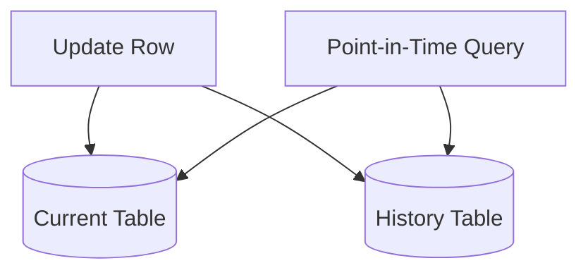
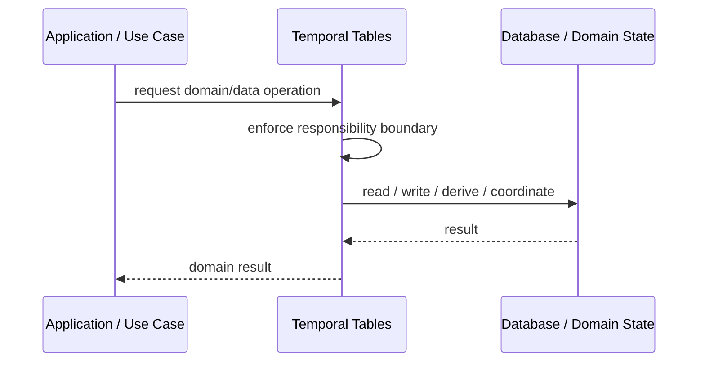
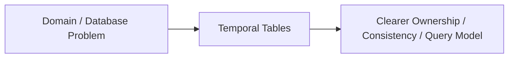

# Temporal Tables

## Core Idea

Temporal Tables keep historical versions of rows so the database can answer what data looked like at a previous time.

---

## Problem It Solves

The system needs point-in-time history, auditability, or time-based queries without manually building history tables everywhere.

---

## 3 Concrete Examples

### Example 1: Customer Address History

Query where a customer lived on a specific date.

### Example 2: Price History

Retrieve product price as of order time.

### Example 3: Compliance Audit

Show previous values of a regulated record over time.

---

## Architect Questions

- Which records need history?
- Do we need valid time, transaction time, or both?
- How much history is retained?
- How are corrections handled?
- Can the database support temporal queries natively?
- How does history affect storage cost?

---

## Main Diagram



---

## Runtime / Responsibility Flow



---

## Implementation Shape

```txt
1. Identify the domain or persistence problem.
2. Define the ownership boundary: entity, aggregate, repository, table, tenant, shard, view, or event stream.
3. Define invariants and consistency requirements.
4. Define how data is loaded, changed, saved, queried, and audited.
5. Define transaction behavior and failure behavior.
6. Add tests around business rules, persistence mapping, concurrency, and edge cases.
7. Keep the pattern focused. Do not use database patterns to hide unclear domain modeling.
```

---

## When to Use

- Point-in-time queries are required.
- Record history is important.
- The database can manage historical versions.

---

## When Not to Use

- History is not needed.
- Storage cost is unacceptable.
- Application-level event history is a better fit.

---

## Common Smell That Suggests This Pattern

```txt
Business rules, persistence logic, identity, history, or query needs are becoming unclear,
duplicated,
too coupled to database details,
or too slow for the current model.
```

---

## Common Mistakes

```txt
Confusing database tables with domain concepts.

Adding abstractions that only pass calls through.

Letting persistence concerns dominate the domain model.

Ignoring transaction boundaries.

Ignoring concurrency and stale data.

Using a complex DDD pattern for simple CRUD.

Using simple CRUD patterns for a complex domain.
```

---

## Best Visual Summary



## Final Meaning

Temporal Tables is useful when it protects business meaning, data consistency, query performance, or persistence boundaries. If the problem is simple CRUD, do not overcomplicate it.
