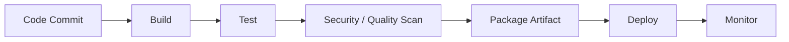
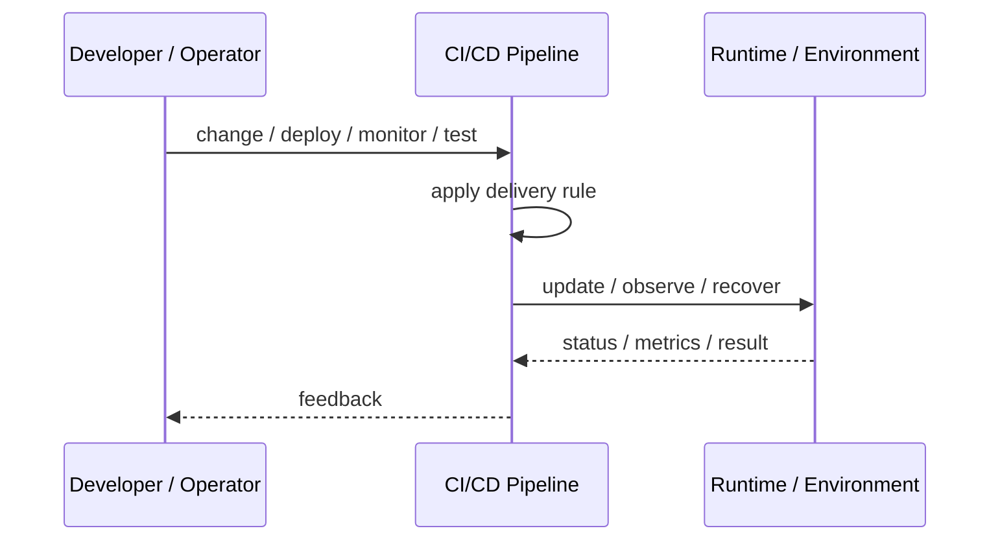
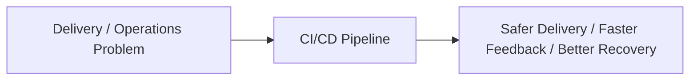

# CI/CD Pipeline

## Core Idea

A CI/CD Pipeline automates building, testing, validating, packaging, and deploying software changes.

---

## Problem It Solves

Manual builds and deployments are slow, inconsistent, risky, and hard to audit.

---

## 3 Concrete Examples

### Example 1: Web Application Pipeline

A commit triggers linting, unit tests, build, container image creation, security scan, and deployment to staging.

### Example 2: Backend API Pipeline

Pull requests run tests and contract checks; merged changes deploy automatically through environments.

### Example 3: Desktop App Release Pipeline

The pipeline builds installers, signs artifacts, runs smoke tests, and publishes release packages.

---

## Architect Questions

- What triggers the pipeline?
- What quality gates must pass before deployment?
- What artifacts are produced?
- How are environments promoted?
- How is rollback handled?
- Who can approve production deployments?

---

## Main Diagram



---

## Runtime / Delivery Flow



---

## Implementation Shape

```txt
1. Identify the delivery or operations problem: release risk, deployment inconsistency, weak feedback, poor visibility, or slow recovery.
2. Define the trigger: commit, merge, config change, alert, health signal, rollout stage, or experiment.
3. Define quality gates and rollback rules.
4. Define environment ownership and promotion flow.
5. Define observability requirements: logs, metrics, traces, health checks, alerts, and dashboards.
6. Test failure paths, not just happy paths.
7. Keep the pattern focused. Do not add operational machinery without ownership and maintenance.
```

---

## When to Use

- You need repeatable build, test, and deployment flow.
- Manual releases are risky or slow.
- Quality gates should be automated.

---

## When Not to Use

- Tests are unreliable and ignored.
- Deployments require undocumented manual steps.
- Pipeline complexity exceeds product needs.

---

## Common Smell That Suggests This Pattern

```txt
Releases are scary,
deployments are manual,
failures are hard to diagnose,
or recovery depends on people remembering undocumented steps.
```

---

## Common Mistakes

```txt
Automating a broken process without fixing it.

Adding tools without clear ownership.

Ignoring rollback.

Ignoring observability.

Treating dashboards as observability.

Letting feature flags, branches, or abstractions live forever.

Running chaos experiments before basic reliability is in place.
```

---

## Best Visual Summary



## Final Meaning

CI/CD Pipeline is useful when it improves delivery safety, repeatability, feedback, or recovery. If nobody owns the process after it is created, it becomes another source of operational debt.
