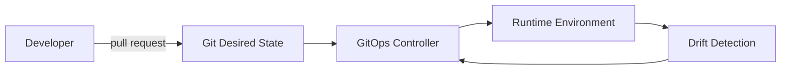
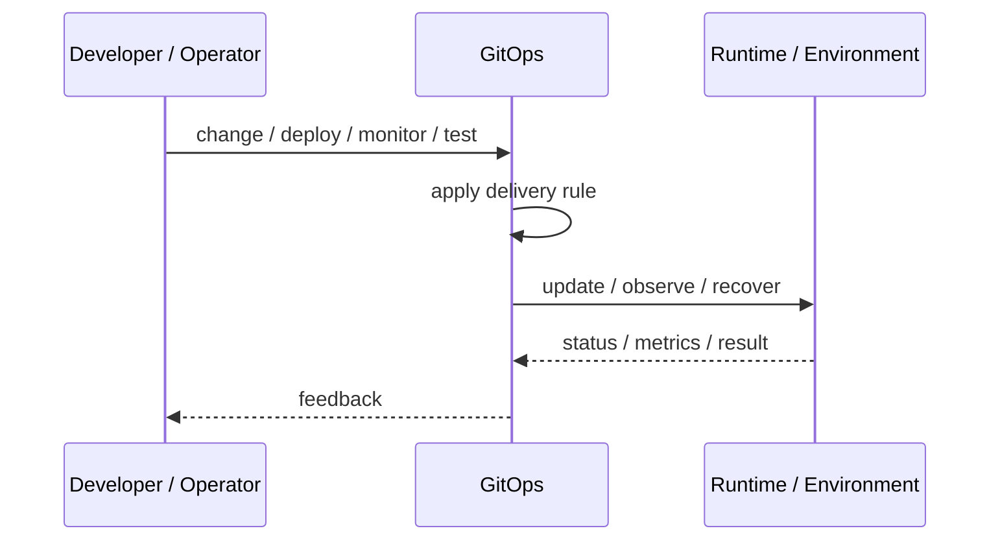
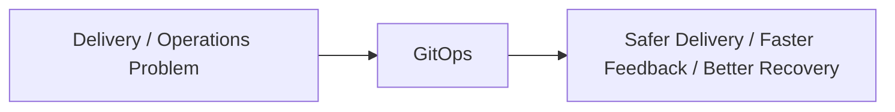

# GitOps

## Core Idea

GitOps uses Git as the source of truth for desired system state, with automated controllers reconciling runtime infrastructure to match Git.

---

## Problem It Solves

Infrastructure and deployment changes become inconsistent when applied manually outside version control.

---

## 3 Concrete Examples

### Example 1: Kubernetes Deployment

Changing a manifest in Git causes a GitOps controller to update the cluster.

### Example 2: Environment Promotion

A pull request changes the image tag in staging or production config.

### Example 3: Drift Correction

Manual changes in the cluster are reverted because they do not match Git.

---

## Architect Questions

- What repository contains desired state?
- What controller reconciles state?
- How are secrets handled?
- How are environment promotions reviewed?
- How is drift detected?
- Who can merge changes to production?

---

## Main Diagram



---

## Runtime / Delivery Flow



---

## Implementation Shape

```txt
1. Identify the delivery or operations problem: release risk, deployment inconsistency, weak feedback, poor visibility, or slow recovery.
2. Define the trigger: commit, merge, config change, alert, health signal, rollout stage, or experiment.
3. Define quality gates and rollback rules.
4. Define environment ownership and promotion flow.
5. Define observability requirements: logs, metrics, traces, health checks, alerts, and dashboards.
6. Test failure paths, not just happy paths.
7. Keep the pattern focused. Do not add operational machinery without ownership and maintenance.
```

---

## When to Use

- Runtime desired state can be represented declaratively.
- Git review should control infrastructure/deployment changes.
- Drift detection and reconciliation are valuable.

---

## When Not to Use

- Runtime state cannot be declared cleanly.
- Teams bypass Git for urgent changes.
- Secrets and environment promotion are not designed.

---

## Common Smell That Suggests This Pattern

```txt
Releases are scary,
deployments are manual,
failures are hard to diagnose,
or recovery depends on people remembering undocumented steps.
```

---

## Common Mistakes

```txt
Automating a broken process without fixing it.

Adding tools without clear ownership.

Ignoring rollback.

Ignoring observability.

Treating dashboards as observability.

Letting feature flags, branches, or abstractions live forever.

Running chaos experiments before basic reliability is in place.
```

---

## Best Visual Summary



## Final Meaning

GitOps is useful when it improves delivery safety, repeatability, feedback, or recovery. If nobody owns the process after it is created, it becomes another source of operational debt.
