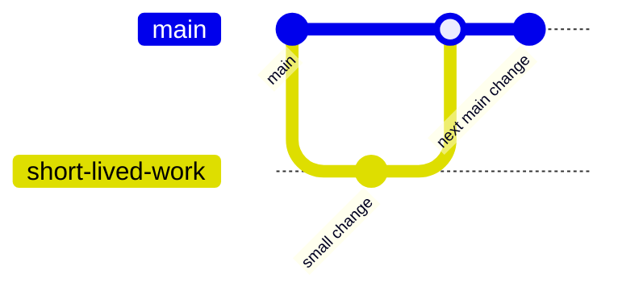
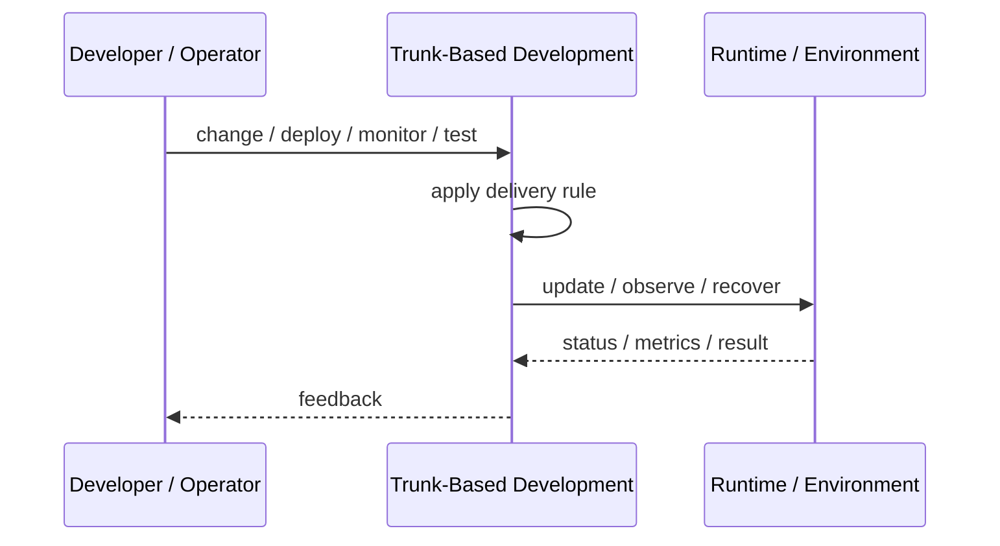
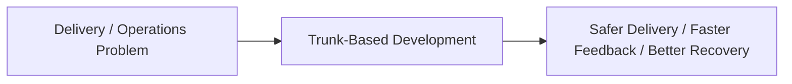

# Trunk-Based Development

## Core Idea

Trunk-Based Development keeps developers integrating small changes frequently into a shared main branch.

---

## Problem It Solves

Long-lived feature branches create painful merges, delayed integration, and late discovery of conflicts.

---

## 3 Concrete Examples

### Example 1: Small Daily Commits

Developers merge small tested changes into main multiple times per day.

### Example 2: Feature Flags with Trunk

Incomplete features are merged behind flags instead of waiting on a branch.

### Example 3: Release Branch Only When Needed

A short-lived release branch is created only for stabilization.

---

## Architect Questions

- Can developers merge small changes safely?
- Are tests fast enough to protect main?
- Are feature flags available for incomplete work?
- How are releases cut from trunk?
- How are broken builds handled?
- What branch lifetime is allowed?

---

## Main Diagram



---

## Runtime / Delivery Flow



---

## Implementation Shape

```txt
1. Identify the delivery or operations problem: release risk, deployment inconsistency, weak feedback, poor visibility, or slow recovery.
2. Define the trigger: commit, merge, config change, alert, health signal, rollout stage, or experiment.
3. Define quality gates and rollback rules.
4. Define environment ownership and promotion flow.
5. Define observability requirements: logs, metrics, traces, health checks, alerts, and dashboards.
6. Test failure paths, not just happy paths.
7. Keep the pattern focused. Do not add operational machinery without ownership and maintenance.
```

---

## When to Use

- Teams can make small frequent changes.
- Automated tests protect main.
- Feature flags can hide incomplete work.

---

## When Not to Use

- Tests are too slow or weak to protect main.
- Large unflagged changes cannot be hidden safely.
- The team is not ready for frequent integration.

---

## Common Smell That Suggests This Pattern

```txt
Releases are scary,
deployments are manual,
failures are hard to diagnose,
or recovery depends on people remembering undocumented steps.
```

---

## Common Mistakes

```txt
Automating a broken process without fixing it.

Adding tools without clear ownership.

Ignoring rollback.

Ignoring observability.

Treating dashboards as observability.

Letting feature flags, branches, or abstractions live forever.

Running chaos experiments before basic reliability is in place.
```

---

## Best Visual Summary



## Final Meaning

Trunk-Based Development is useful when it improves delivery safety, repeatability, feedback, or recovery. If nobody owns the process after it is created, it becomes another source of operational debt.
