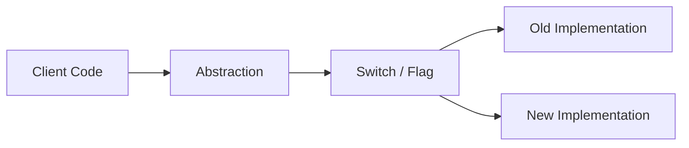
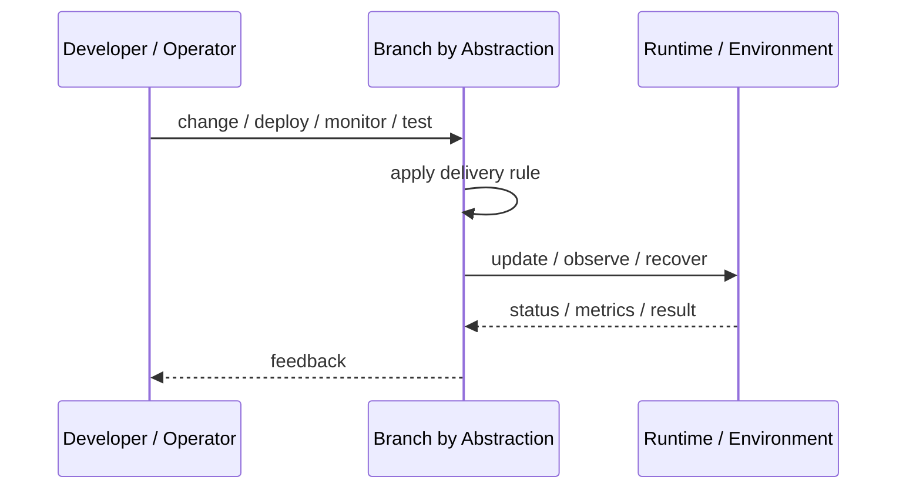
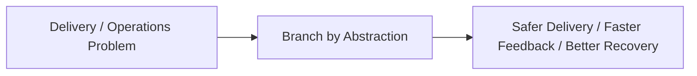

# Branch by Abstraction

## Core Idea

Branch by Abstraction lets teams make large code changes on the main branch by introducing an abstraction layer and switching implementations gradually.

---

## Problem It Solves

Large refactors or replacements are risky when done on long-lived branches that diverge from main.

---

## 3 Concrete Examples

### Example 1: Payment Provider Replacement

Introduce PaymentGateway interface, run old and new providers behind it, then switch.

### Example 2: Database Access Refactor

Add repository abstraction and migrate queries module by module.

### Example 3: UI Framework Migration

Wrap old and new UI components behind a common interface during migration.

---

## Architect Questions

- What abstraction isolates the old and new implementation?
- Can both implementations coexist?
- How will traffic or calls be switched?
- How is parity verified?
- When will the old implementation be removed?
- Will the abstraction become permanent unnecessary complexity?

---

## Main Diagram



---

## Runtime / Delivery Flow



---

## Implementation Shape

```txt
1. Identify the delivery or operations problem: release risk, deployment inconsistency, weak feedback, poor visibility, or slow recovery.
2. Define the trigger: commit, merge, config change, alert, health signal, rollout stage, or experiment.
3. Define quality gates and rollback rules.
4. Define environment ownership and promotion flow.
5. Define observability requirements: logs, metrics, traces, health checks, alerts, and dashboards.
6. Test failure paths, not just happy paths.
7. Keep the pattern focused. Do not add operational machinery without ownership and maintenance.
```

---

## When to Use

- A large change must happen without a long-lived branch.
- Old and new implementations can coexist.
- Gradual switching and cleanup are planned.

---

## When Not to Use

- The abstraction will become permanent clutter.
- Old and new implementations cannot coexist.
- The migration has no cleanup plan.

---

## Common Smell That Suggests This Pattern

```txt
Releases are scary,
deployments are manual,
failures are hard to diagnose,
or recovery depends on people remembering undocumented steps.
```

---

## Common Mistakes

```txt
Automating a broken process without fixing it.

Adding tools without clear ownership.

Ignoring rollback.

Ignoring observability.

Treating dashboards as observability.

Letting feature flags, branches, or abstractions live forever.

Running chaos experiments before basic reliability is in place.
```

---

## Best Visual Summary



## Final Meaning

Branch by Abstraction is useful when it improves delivery safety, repeatability, feedback, or recovery. If nobody owns the process after it is created, it becomes another source of operational debt.
