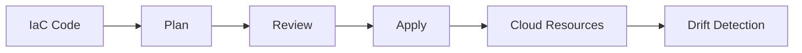
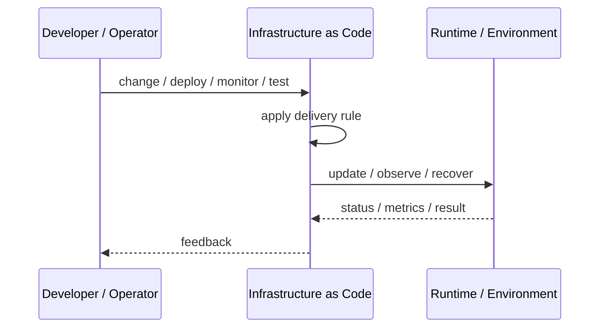
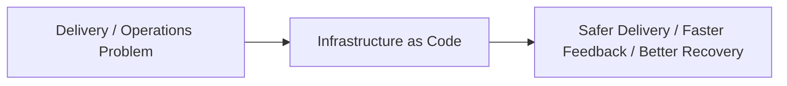

# Infrastructure as Code

## Core Idea

Infrastructure as Code defines infrastructure in versioned, reviewable, repeatable code instead of manual configuration.

---

## Problem It Solves

Manual infrastructure changes create drift, inconsistency, weak auditability, and unreliable recovery.

---

## 3 Concrete Examples

### Example 1: Terraform Environment

Networks, databases, load balancers, and IAM are declared in Terraform modules.

### Example 2: Kubernetes Manifests

Deployments, services, and config are defined as YAML and applied by automation.

### Example 3: Cloud Landing Zone

Accounts, policies, networking, and security baselines are created from code.

---

## Architect Questions

- What resources are managed as code?
- How is state managed?
- How are secrets handled?
- How are changes reviewed and approved?
- How is drift detected?
- How are modules versioned?

---

## Main Diagram



---

## Runtime / Delivery Flow



---

## Implementation Shape

```txt
1. Identify the delivery or operations problem: release risk, deployment inconsistency, weak feedback, poor visibility, or slow recovery.
2. Define the trigger: commit, merge, config change, alert, health signal, rollout stage, or experiment.
3. Define quality gates and rollback rules.
4. Define environment ownership and promotion flow.
5. Define observability requirements: logs, metrics, traces, health checks, alerts, and dashboards.
6. Test failure paths, not just happy paths.
7. Keep the pattern focused. Do not add operational machinery without ownership and maintenance.
```

---

## When to Use

- Infrastructure must be reproducible.
- Audit and review are required.
- Manual drift is a problem.

---

## When Not to Use

- Resources are experimental and throwaway.
- State management and secrets are not understood.
- Everyone will still change infrastructure manually.

---

## Common Smell That Suggests This Pattern

```txt
Releases are scary,
deployments are manual,
failures are hard to diagnose,
or recovery depends on people remembering undocumented steps.
```

---

## Common Mistakes

```txt
Automating a broken process without fixing it.

Adding tools without clear ownership.

Ignoring rollback.

Ignoring observability.

Treating dashboards as observability.

Letting feature flags, branches, or abstractions live forever.

Running chaos experiments before basic reliability is in place.
```

---

## Best Visual Summary



## Final Meaning

Infrastructure as Code is useful when it improves delivery safety, repeatability, feedback, or recovery. If nobody owns the process after it is created, it becomes another source of operational debt.
