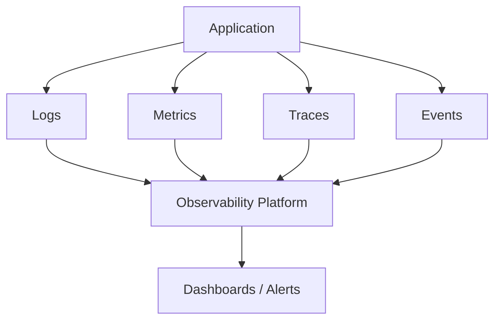
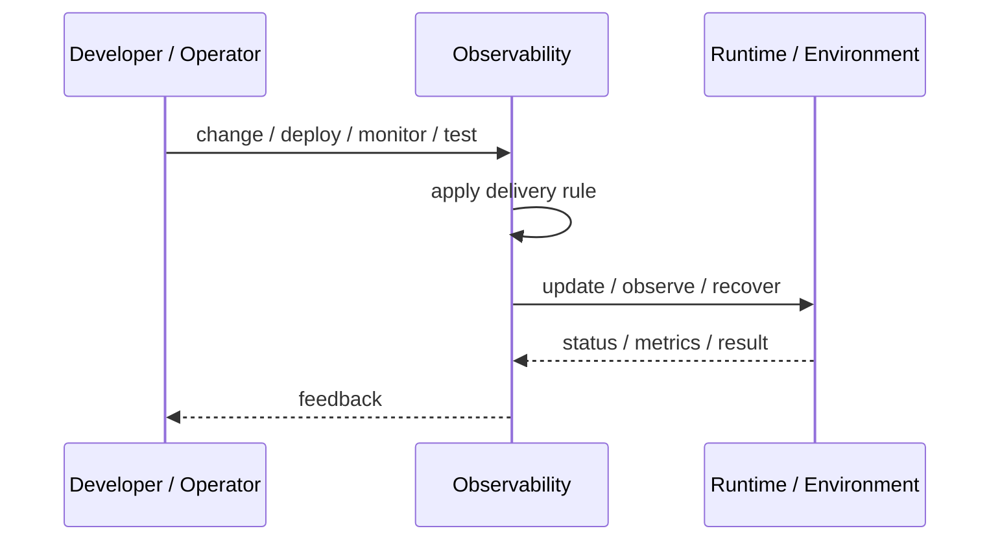
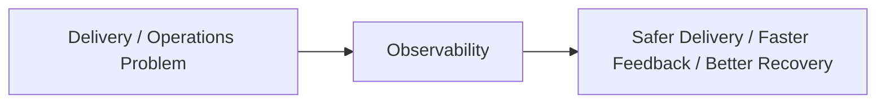

# Observability

## Core Idea

Observability makes system behavior understandable from external signals such as logs, metrics, traces, events, and profiles.

---

## Problem It Solves

Teams cannot diagnose production issues if they cannot see what the system is doing and why.

---

## 3 Concrete Examples

### Example 1: API Latency Diagnosis

Metrics show latency spike, traces identify slow dependency, logs show error details.

### Example 2: Queue Backlog Investigation

Queue depth metrics and worker logs reveal a stuck consumer.

### Example 3: Release Monitoring

Dashboards compare error rate, latency, and saturation before and after deployment.

---

## Architect Questions

- What questions must operators answer during incidents?
- What metrics represent health?
- What logs contain useful context?
- Where are traces needed?
- How are signals correlated?
- What alerts indicate user impact?

---

## Main Diagram



---

## Runtime / Delivery Flow



---

## Implementation Shape

```txt
1. Identify the delivery or operations problem: release risk, deployment inconsistency, weak feedback, poor visibility, or slow recovery.
2. Define the trigger: commit, merge, config change, alert, health signal, rollout stage, or experiment.
3. Define quality gates and rollback rules.
4. Define environment ownership and promotion flow.
5. Define observability requirements: logs, metrics, traces, health checks, alerts, and dashboards.
6. Test failure paths, not just happy paths.
7. Keep the pattern focused. Do not add operational machinery without ownership and maintenance.
```

---

## When to Use

- Production behavior must be diagnosable.
- Incidents require fast root-cause analysis.
- Teams need logs, metrics, and traces correlated.

---

## When Not to Use

- Signals are collected but never used.
- Logs/metrics/traces contain no useful context.
- No one owns dashboards or alerts.

---

## Common Smell That Suggests This Pattern

```txt
Releases are scary,
deployments are manual,
failures are hard to diagnose,
or recovery depends on people remembering undocumented steps.
```

---

## Common Mistakes

```txt
Automating a broken process without fixing it.

Adding tools without clear ownership.

Ignoring rollback.

Ignoring observability.

Treating dashboards as observability.

Letting feature flags, branches, or abstractions live forever.

Running chaos experiments before basic reliability is in place.
```

---

## Best Visual Summary



## Final Meaning

Observability is useful when it improves delivery safety, repeatability, feedback, or recovery. If nobody owns the process after it is created, it becomes another source of operational debt.
