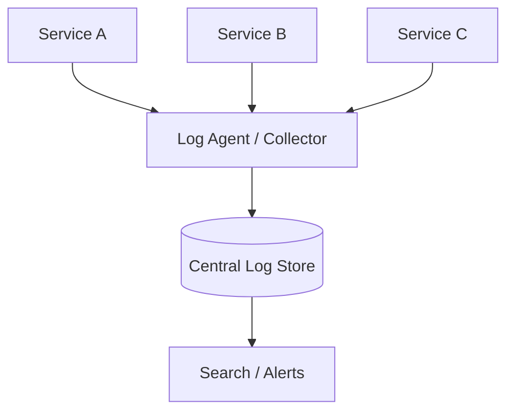
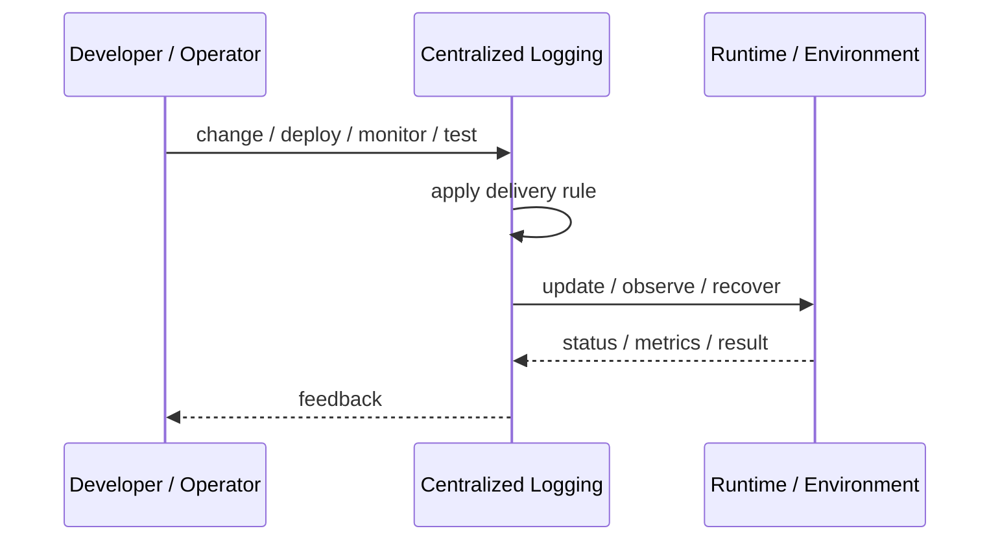
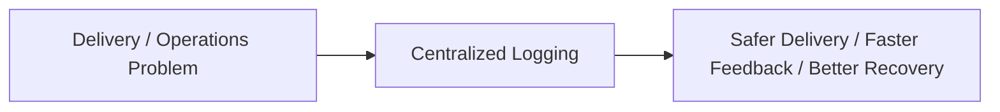

# Centralized Logging

## Core Idea

Centralized Logging collects logs from many services and systems into one searchable platform.

---

## Problem It Solves

Logs scattered across servers, containers, and services make debugging slow and incomplete.

---

## 3 Concrete Examples

### Example 1: Microservice Logs

All service logs are shipped to one logging platform with service, environment, and trace IDs.

### Example 2: Security Audit Logs

Authentication and admin actions are centralized for investigation.

### Example 3: Kubernetes Logs

Pod logs are collected by agents and indexed centrally.

---

## Architect Questions

- What systems produce logs?
- What fields should every log include?
- How are correlation IDs propagated?
- How long are logs retained?
- How is sensitive data redacted?
- What alerts are based on logs?

---

## Main Diagram



---

## Runtime / Delivery Flow



---

## Implementation Shape

```txt
1. Identify the delivery or operations problem: release risk, deployment inconsistency, weak feedback, poor visibility, or slow recovery.
2. Define the trigger: commit, merge, config change, alert, health signal, rollout stage, or experiment.
3. Define quality gates and rollback rules.
4. Define environment ownership and promotion flow.
5. Define observability requirements: logs, metrics, traces, health checks, alerts, and dashboards.
6. Test failure paths, not just happy paths.
7. Keep the pattern focused. Do not add operational machinery without ownership and maintenance.
```

---

## When to Use

- Many systems produce logs.
- Debugging requires searching across services.
- Audit and retention are needed.

---

## When Not to Use

- Sensitive data cannot be protected.
- Log volume cost is uncontrolled.
- Logs are unstructured and impossible to query.

---

## Common Smell That Suggests This Pattern

```txt
Releases are scary,
deployments are manual,
failures are hard to diagnose,
or recovery depends on people remembering undocumented steps.
```

---

## Common Mistakes

```txt
Automating a broken process without fixing it.

Adding tools without clear ownership.

Ignoring rollback.

Ignoring observability.

Treating dashboards as observability.

Letting feature flags, branches, or abstractions live forever.

Running chaos experiments before basic reliability is in place.
```

---

## Best Visual Summary



## Final Meaning

Centralized Logging is useful when it improves delivery safety, repeatability, feedback, or recovery. If nobody owns the process after it is created, it becomes another source of operational debt.
