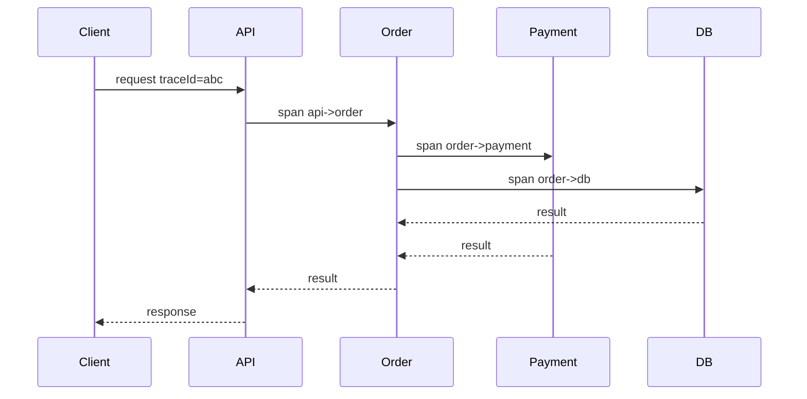
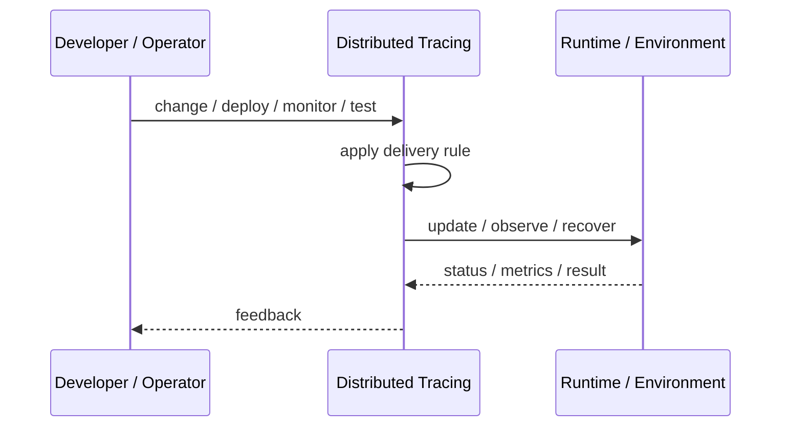
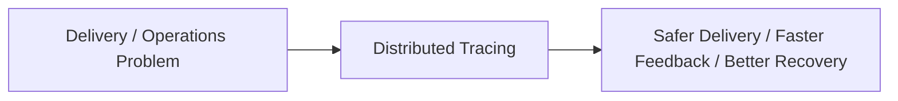

# Distributed Tracing

## Core Idea

Distributed Tracing follows a request across services using trace and span IDs.

---

## Problem It Solves

In distributed systems, a user request crosses many services and failures are hard to locate from local logs alone.

---

## 3 Concrete Examples

### Example 1: Checkout Trace

A checkout request is traced through cart, inventory, payment, shipping, and notification services.

### Example 2: Latency Root Cause

A trace shows most time spent waiting on a slow database call.

### Example 3: Error Path Debugging

A failed request trace identifies which service returned an error.

---

## Architect Questions

- Where is the trace started?
- How are trace IDs propagated?
- Which operations create spans?
- What sampling rate is appropriate?
- How are errors recorded on spans?
- How are traces linked to logs and metrics?

---

## Main Diagram



---

## Runtime / Delivery Flow



---

## Implementation Shape

```txt
1. Identify the delivery or operations problem: release risk, deployment inconsistency, weak feedback, poor visibility, or slow recovery.
2. Define the trigger: commit, merge, config change, alert, health signal, rollout stage, or experiment.
3. Define quality gates and rollback rules.
4. Define environment ownership and promotion flow.
5. Define observability requirements: logs, metrics, traces, health checks, alerts, and dashboards.
6. Test failure paths, not just happy paths.
7. Keep the pattern focused. Do not add operational machinery without ownership and maintenance.
```

---

## When to Use

- Requests cross service boundaries.
- Latency and error root cause are hard to find.
- Trace context can be propagated.

---

## When Not to Use

- The system is not distributed.
- Trace propagation cannot be implemented.
- Sampling or storage costs make traces unusable.

---

## Common Smell That Suggests This Pattern

```txt
Releases are scary,
deployments are manual,
failures are hard to diagnose,
or recovery depends on people remembering undocumented steps.
```

---

## Common Mistakes

```txt
Automating a broken process without fixing it.

Adding tools without clear ownership.

Ignoring rollback.

Ignoring observability.

Treating dashboards as observability.

Letting feature flags, branches, or abstractions live forever.

Running chaos experiments before basic reliability is in place.
```

---

## Best Visual Summary



## Final Meaning

Distributed Tracing is useful when it improves delivery safety, repeatability, feedback, or recovery. If nobody owns the process after it is created, it becomes another source of operational debt.
