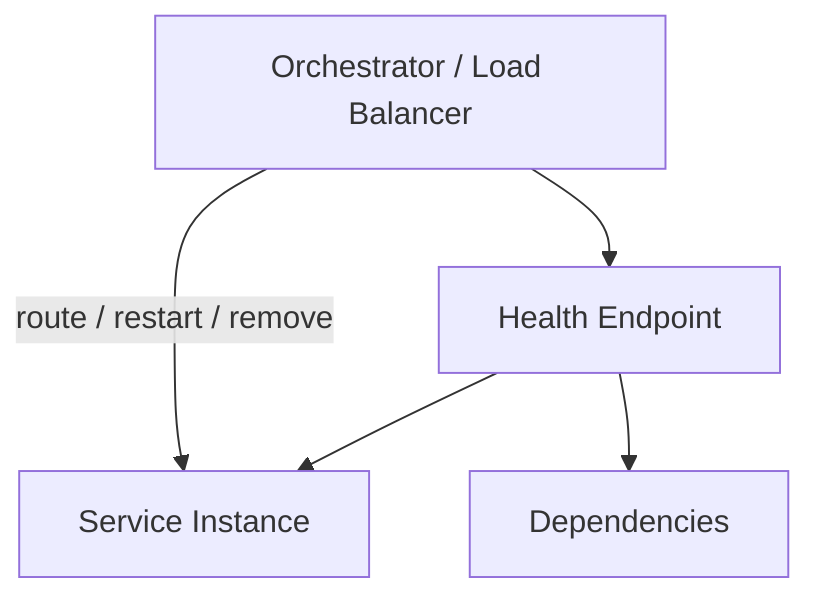
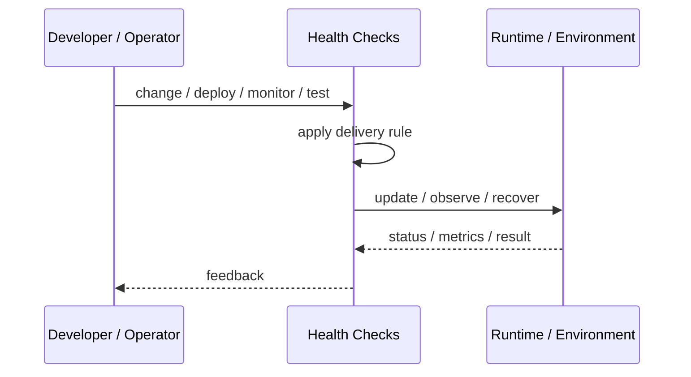
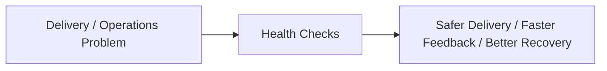

# Health Checks

## Core Idea

Health Checks expose signals that indicate whether a service instance is alive, ready, and able to serve traffic.

---

## Problem It Solves

Load balancers and orchestrators need reliable signals to route traffic and restart broken instances.

---

## 3 Concrete Examples

### Example 1: Liveness Probe

A container is restarted if it stops responding.

### Example 2: Readiness Probe

Traffic is sent only after the service has loaded config and connected to dependencies.

### Example 3: Dependency Health Endpoint

A service reports database or queue connectivity for operational diagnosis.

---

## Architect Questions

- What does alive mean?
- What does ready mean?
- Should dependency failures make the service unready?
- How expensive is the health check?
- Can health checks cause cascading failures?
- What should orchestration do on failure?

---

## Main Diagram



---

## Runtime / Delivery Flow



---

## Implementation Shape

```txt
1. Identify the delivery or operations problem: release risk, deployment inconsistency, weak feedback, poor visibility, or slow recovery.
2. Define the trigger: commit, merge, config change, alert, health signal, rollout stage, or experiment.
3. Define quality gates and rollback rules.
4. Define environment ownership and promotion flow.
5. Define observability requirements: logs, metrics, traces, health checks, alerts, and dashboards.
6. Test failure paths, not just happy paths.
7. Keep the pattern focused. Do not add operational machinery without ownership and maintenance.
```

---

## When to Use

- Load balancers or orchestrators need service status.
- Instances should be removed or restarted automatically.
- Startup readiness matters.

---

## When Not to Use

- Checks are expensive or flaky.
- Health endpoints report healthy while the app is broken.
- Dependency checks cause cascading restarts.

---

## Common Smell That Suggests This Pattern

```txt
Releases are scary,
deployments are manual,
failures are hard to diagnose,
or recovery depends on people remembering undocumented steps.
```

---

## Common Mistakes

```txt
Automating a broken process without fixing it.

Adding tools without clear ownership.

Ignoring rollback.

Ignoring observability.

Treating dashboards as observability.

Letting feature flags, branches, or abstractions live forever.

Running chaos experiments before basic reliability is in place.
```

---

## Best Visual Summary



## Final Meaning

Health Checks is useful when it improves delivery safety, repeatability, feedback, or recovery. If nobody owns the process after it is created, it becomes another source of operational debt.
