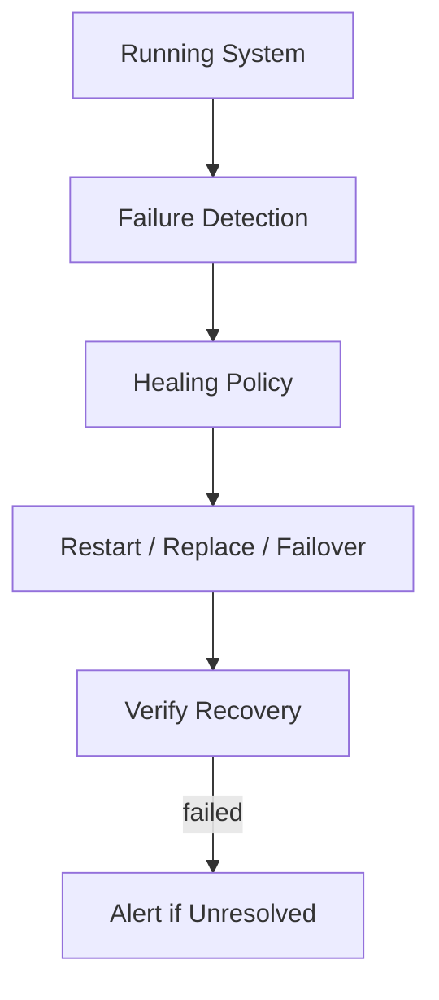
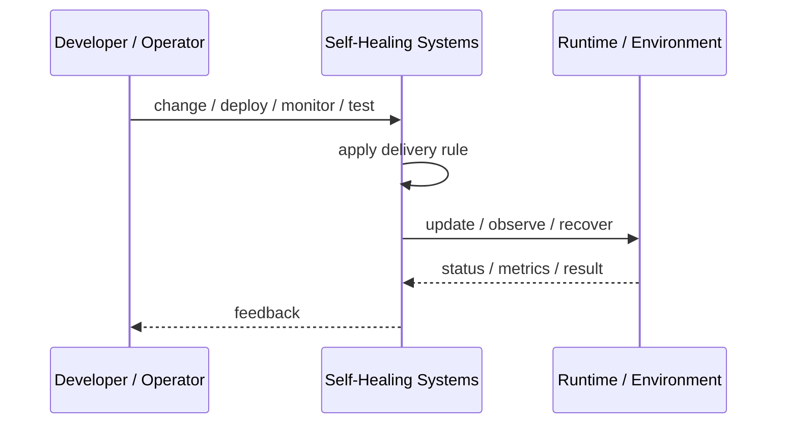

# Self-Healing Systems

## Core Idea

Self-Healing Systems automatically detect failure and take corrective action without human intervention.

---

## Problem It Solves

Manual recovery is too slow and unreliable for common, predictable failures.

---

## 3 Concrete Examples

### Example 1: Container Restart

A failed pod is automatically restarted by the orchestrator.

### Example 2: Auto Replacement

An unhealthy VM is terminated and replaced by an auto scaling group.

### Example 3: Queue Worker Recovery

A stuck worker is detected and restarted while its message is retried.

---

## Architect Questions

- What failures can be detected reliably?
- What automatic action is safe?
- How do we avoid restart loops?
- When should humans be alerted?
- How is state protected during recovery?
- How are recovery actions audited?

---

## Main Diagram



---

## Runtime / Delivery Flow



---

## Implementation Shape

```txt
1. Identify the delivery or operations problem: release risk, deployment inconsistency, weak feedback, poor visibility, or slow recovery.
2. Define the trigger: commit, merge, config change, alert, health signal, rollout stage, or experiment.
3. Define quality gates and rollback rules.
4. Define environment ownership and promotion flow.
5. Define observability requirements: logs, metrics, traces, health checks, alerts, and dashboards.
6. Test failure paths, not just happy paths.
7. Keep the pattern focused. Do not add operational machinery without ownership and maintenance.
```

---

## When to Use

- Failures are predictable and recoverable.
- Automatic recovery is safer and faster than manual response.
- State can survive restart or replacement.

---

## When Not to Use

- Automatic action could corrupt state.
- Failure detection is unreliable.
- Restart loops hide real incidents.

---

## Common Smell That Suggests This Pattern

```txt
Releases are scary,
deployments are manual,
failures are hard to diagnose,
or recovery depends on people remembering undocumented steps.
```

---

## Common Mistakes

```txt
Automating a broken process without fixing it.

Adding tools without clear ownership.

Ignoring rollback.

Ignoring observability.

Treating dashboards as observability.

Letting feature flags, branches, or abstractions live forever.

Running chaos experiments before basic reliability is in place.
```

---

## Best Visual Summary


## Final Meaning

Self-Healing Systems is useful when it improves delivery safety, repeatability, feedback, or recovery. If nobody owns the process after it is created, it becomes another source of operational debt.
