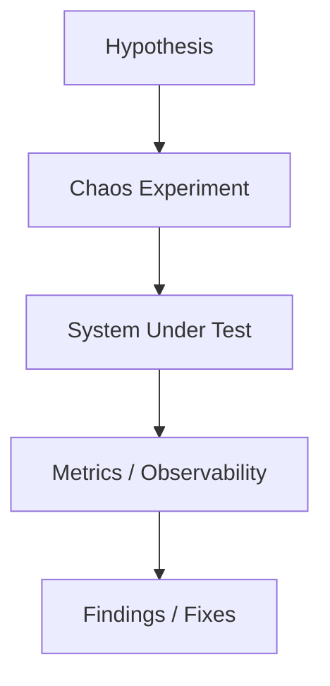
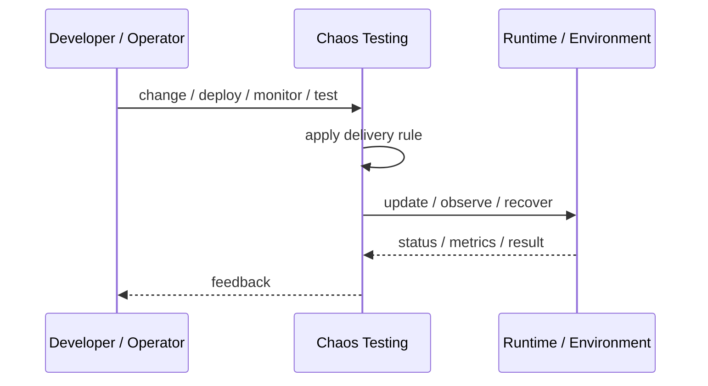

# Chaos Testing

## Core Idea

Chaos Testing deliberately injects controlled failures to verify the system behaves correctly under stress or partial failure.

---

## Problem It Solves

Reliability assumptions are often wrong until failure modes are tested.

---

## 3 Concrete Examples

### Example 1: Kill Instance Test

Terminate a service instance and verify traffic shifts to healthy replicas.

### Example 2: Network Latency Test

Inject latency between services and verify timeouts and fallbacks work.

### Example 3: Dependency Outage Drill

Disable a downstream dependency and verify graceful degradation.

---

## Architect Questions

- What hypothesis is being tested?
- What is the blast radius?
- What safeguards stop the experiment?
- What metrics prove success or failure?
- Is production testing safe?
- What fixes are required after findings?

---

## Main Diagram



---

## Runtime / Delivery Flow



---

## Implementation Shape

```txt
1. Identify the delivery or operations problem: release risk, deployment inconsistency, weak feedback, poor visibility, or slow recovery.
2. Define the trigger: commit, merge, config change, alert, health signal, rollout stage, or experiment.
3. Define quality gates and rollback rules.
4. Define environment ownership and promotion flow.
5. Define observability requirements: logs, metrics, traces, health checks, alerts, and dashboards.
6. Test failure paths, not just happy paths.
7. Keep the pattern focused. Do not add operational machinery without ownership and maintenance.
```

---

## When to Use

- You have observability and safeguards.
- Reliability assumptions need validation.
- The team can act on findings.

---

## When Not to Use

- There is no monitoring or rollback.
- Blast radius cannot be controlled.
- The team is not ready to fix discovered weaknesses.

---

## Common Smell That Suggests This Pattern

```txt
Releases are scary,
deployments are manual,
failures are hard to diagnose,
or recovery depends on people remembering undocumented steps.
```

---

## Common Mistakes

```txt
Automating a broken process without fixing it.

Adding tools without clear ownership.

Ignoring rollback.

Ignoring observability.

Treating dashboards as observability.

Letting feature flags, branches, or abstractions live forever.

Running chaos experiments before basic reliability is in place.
```

---

## Best Visual Summary


## Final Meaning

Chaos Testing is useful when it improves delivery safety, repeatability, feedback, or recovery. If nobody owns the process after it is created, it becomes another source of operational debt.
