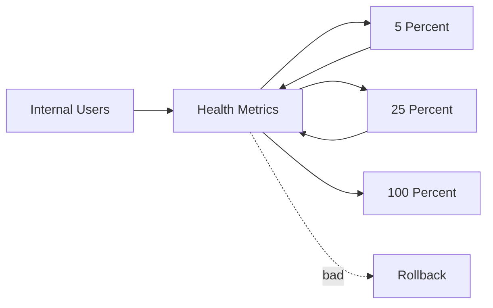
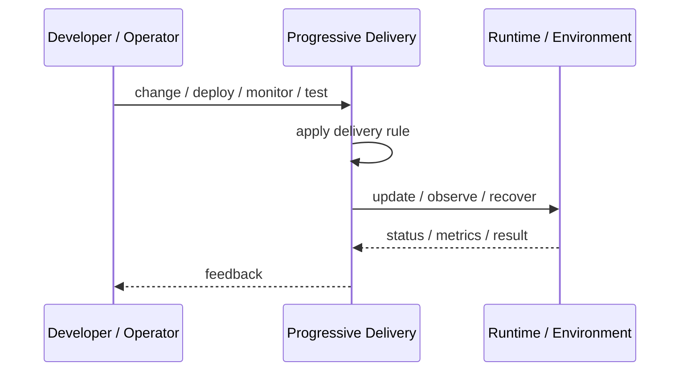
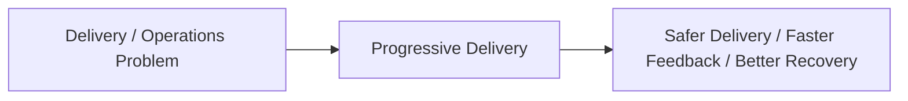

# Progressive Delivery

## Core Idea

Progressive Delivery releases changes gradually using automation, metrics, and controlled exposure.

---

## Problem It Solves

Releasing to everyone at once increases blast radius when a change is bad.

---

## 3 Concrete Examples

### Example 1: Canary Release

A new version starts at 5% traffic and increases if metrics are healthy.

### Example 2: Feature Flag Rollout

A feature is enabled for internal users, then beta customers, then everyone.

### Example 3: Automated Promotion

Deployment advances through stages only if error rate and latency stay within thresholds.

---

## Architect Questions

- What exposure stages are used?
- What metrics gate progression?
- How is rollback triggered?
- Can users be consistently targeted?
- Are database changes backward compatible?
- Who approves final rollout?

---

## Main Diagram



---

## Runtime / Delivery Flow



---

## Implementation Shape

```txt
1. Identify the delivery or operations problem: release risk, deployment inconsistency, weak feedback, poor visibility, or slow recovery.
2. Define the trigger: commit, merge, config change, alert, health signal, rollout stage, or experiment.
3. Define quality gates and rollback rules.
4. Define environment ownership and promotion flow.
5. Define observability requirements: logs, metrics, traces, health checks, alerts, and dashboards.
6. Test failure paths, not just happy paths.
7. Keep the pattern focused. Do not add operational machinery without ownership and maintenance.
```

---

## When to Use

- Release blast radius must be reduced.
- Metrics can guide rollout decisions.
- Traffic or users can be targeted gradually.

---

## When Not to Use

- No reliable health metrics exist.
- Traffic cannot be segmented.
- Database changes are not backward compatible.

---

## Common Smell That Suggests This Pattern

```txt
Releases are scary,
deployments are manual,
failures are hard to diagnose,
or recovery depends on people remembering undocumented steps.
```

---

## Common Mistakes

```txt
Automating a broken process without fixing it.

Adding tools without clear ownership.

Ignoring rollback.

Ignoring observability.

Treating dashboards as observability.

Letting feature flags, branches, or abstractions live forever.

Running chaos experiments before basic reliability is in place.
```

---

## Best Visual Summary



## Final Meaning

Progressive Delivery is useful when it improves delivery safety, repeatability, feedback, or recovery. If nobody owns the process after it is created, it becomes another source of operational debt.
