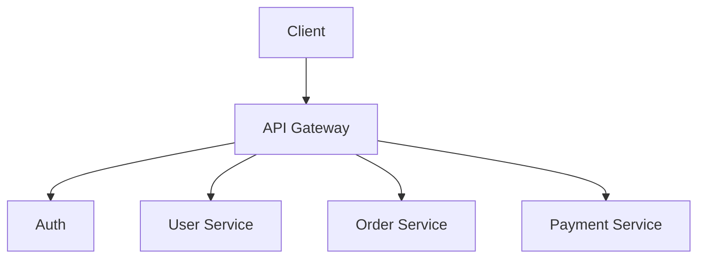
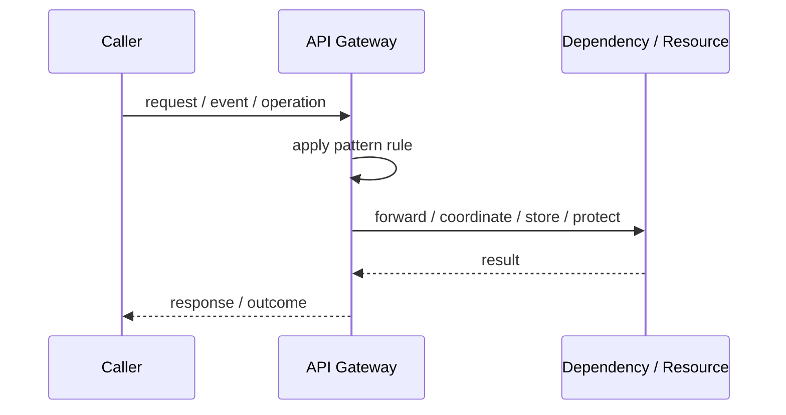
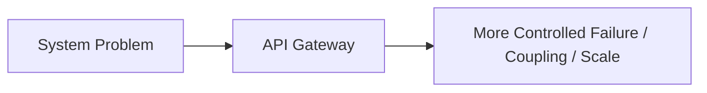

# API Gateway

## Core Idea

An API Gateway sits between clients and backend services. It routes requests, can aggregate responses, and centralizes cross-cutting concerns like authentication, rate limits, request shaping, and protocol translation.

---

## Problem It Solves

Multiple clients need one entry point into a backend made of several services.

---

## 3 Concrete Examples

### Example 1: Mobile App Gateway

A mobile app calls one gateway endpoint that aggregates profile, orders, and notifications instead of making many calls.

### Example 2: Public Partner API

External partners call a gateway that validates tokens, applies quotas, and routes to internal services.

### Example 3: Microservices Front Door

A web client calls the gateway, which routes traffic to user, order, payment, and inventory services.

---

## Architect Questions

- Do clients currently call too many backend services directly?
- Do different clients need different API shapes?
- Should authentication, rate limiting, or request validation be centralized?
- Will the gateway aggregate data or only route requests?
- Can the gateway become a bottleneck or god service?
- Who owns gateway routes and versioning?

---

## Main Diagram



---

## Runtime / Responsibility Flow



---

## Implementation Shape

```txt
1. Identify the exact failure, scaling, coupling, or consistency problem.
2. Define the boundary where this pattern applies.
3. Define ownership: who owns data, policy, configuration, and failure handling.
4. Define the happy path and the failure path.
5. Add observability: logs, metrics, tracing, alerts, and dashboards.
6. Add tests for normal behavior, failure behavior, retry behavior, and edge cases.
7. Keep the pattern focused. Do not let it become a dumping ground for unrelated business logic.
```

---

## When to Use

- You need a single entry point for clients.
- Backend services should not be exposed directly.
- You need request routing, aggregation, authentication, or rate limiting at the edge.

---

## When Not to Use

- The system has one backend service.
- The gateway would contain core business logic.
- The gateway becomes a large centralized bottleneck.

---

## Common Smell That Suggests This Pattern

```txt
The current design is failing because one part of the system is overloaded,
too tightly coupled,
not isolated enough,
or not reliable enough under failure.
```

---

## Common Mistakes

```txt
Using the pattern name without enforcing the actual boundary.

Adding distributed-systems complexity before the problem is real.

Ignoring failure modes.

Ignoring duplicate requests or duplicate messages.

Forgetting observability.

Letting the pattern hide business logic instead of clarifying it.
```

---

## Best Visual Summary



## Final Meaning

API Gateway is useful only when it solves a real architectural pressure. If the pressure is not real yet, this pattern can become unnecessary complexity.
