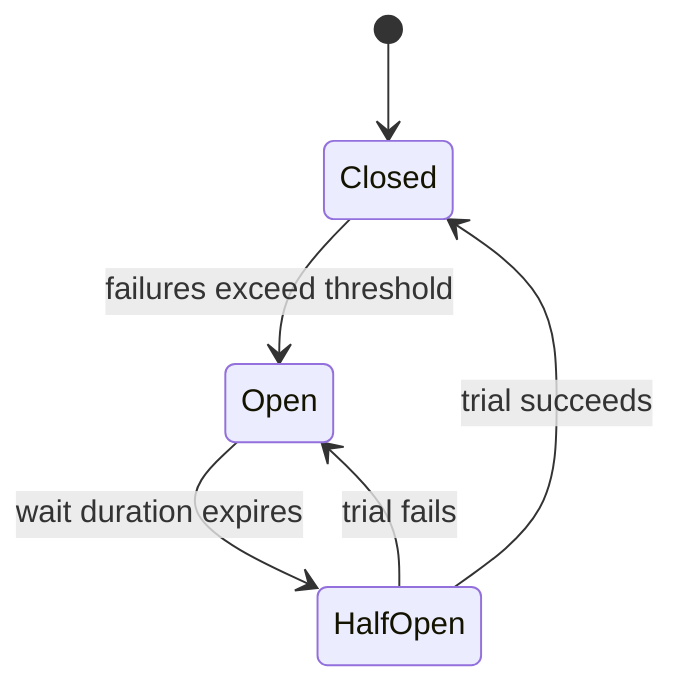
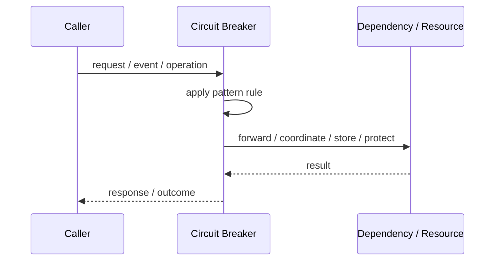
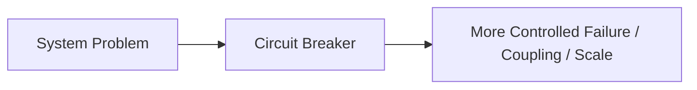

# Circuit Breaker

## Core Idea

Circuit Breaker stops calls to a failing dependency temporarily. It opens after failures, blocks calls for a recovery window, then allows limited trial calls before closing again.

---

## Problem It Solves

Repeated calls to a failing dependency can overload the dependency and cause cascading failures.

---

## 3 Concrete Examples

### Example 1: Payment Provider Failure

Checkout stops hammering a payment provider that is timing out and returns a controlled failure response.

### Example 2: Search Service Timeout

The product page skips recommendations when search is down instead of blocking the whole page.

### Example 3: Inventory Dependency Protection

Order service pauses inventory calls after repeated errors and avoids thread exhaustion.

---

## Architect Questions

- Which dependency failure could cascade through the system?
- What failure rate or timeout threshold opens the circuit?
- What fallback should callers receive?
- How long should the circuit stay open?
- What metrics prove the dependency recovered?
- Can users tolerate degraded behavior?

---

## Main Diagram



---

## Runtime / Responsibility Flow



---

## Implementation Shape

```txt
1. Identify the exact failure, scaling, coupling, or consistency problem.
2. Define the boundary where this pattern applies.
3. Define ownership: who owns data, policy, configuration, and failure handling.
4. Define the happy path and the failure path.
5. Add observability: logs, metrics, tracing, alerts, and dashboards.
6. Add tests for normal behavior, failure behavior, retry behavior, and edge cases.
7. Keep the pattern focused. Do not let it become a dumping ground for unrelated business logic.
```

---

## When to Use

- Remote calls can fail or timeout.
- Cascading failure is a real risk.
- Fallback or degraded behavior is possible.

---

## When Not to Use

- Local in-memory calls.
- Failures must always be retried immediately.
- There is no meaningful fallback or failure handling strategy.

---

## Common Smell That Suggests This Pattern

```txt
The current design is failing because one part of the system is overloaded,
too tightly coupled,
not isolated enough,
or not reliable enough under failure.
```

---

## Common Mistakes

```txt
Using the pattern name without enforcing the actual boundary.

Adding distributed-systems complexity before the problem is real.

Ignoring failure modes.

Ignoring duplicate requests or duplicate messages.

Forgetting observability.

Letting the pattern hide business logic instead of clarifying it.
```

---

## Best Visual Summary



## Final Meaning

Circuit Breaker is useful only when it solves a real architectural pressure. If the pressure is not real yet, this pattern can become unnecessary complexity.
