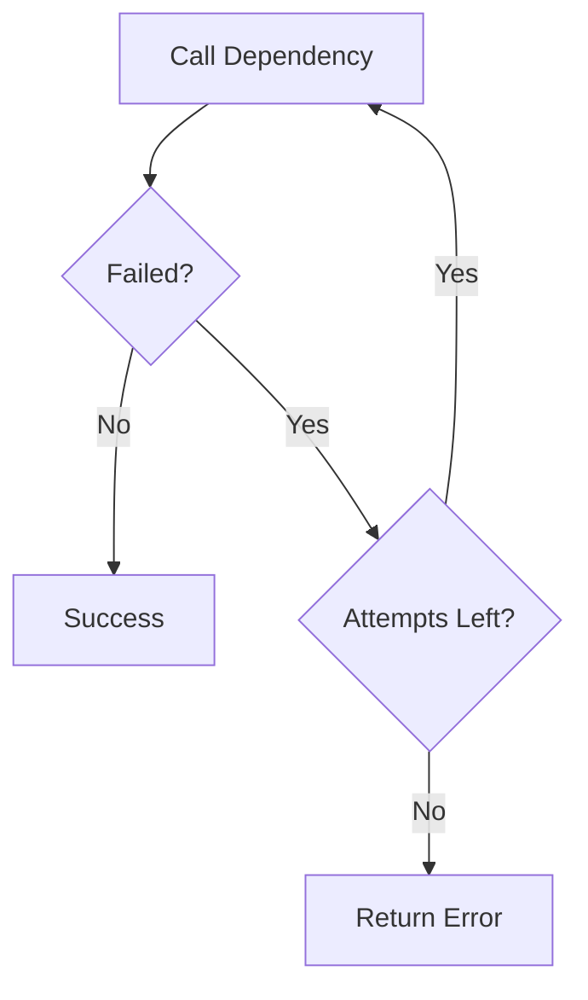
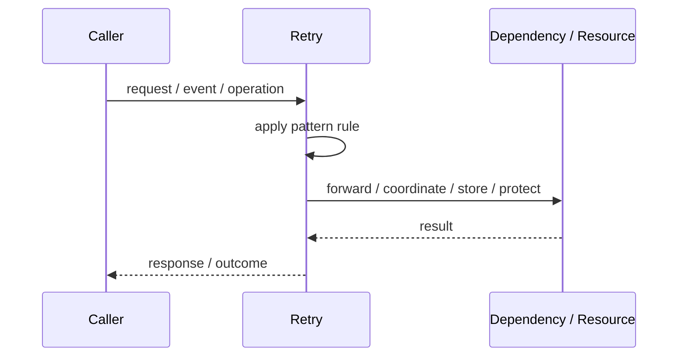
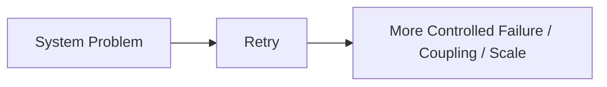

# Retry

## Core Idea

Retry repeats a failed operation a limited number of times when the failure is likely temporary.

---

## Problem It Solves

Transient failures can cause operations to fail even though repeating the operation shortly after would succeed.

---

## 3 Concrete Examples

### Example 1: Temporary Network Error

An API client retries a request after a connection reset.

### Example 2: Database Deadlock

A transaction is retried after a deadlock error.

### Example 3: Queue Publish Failure

A worker retries publishing a message when the broker briefly disconnects.

---

## Architect Questions

- Is the failure transient or permanent?
- Is the operation safe to repeat?
- How many attempts are allowed?
- Which errors are retryable?
- What happens after all retries fail?
- Could retries amplify load during an outage?

---

## Main Diagram



---

## Runtime / Responsibility Flow



---

## Implementation Shape

```txt
1. Identify the exact failure, scaling, coupling, or consistency problem.
2. Define the boundary where this pattern applies.
3. Define ownership: who owns data, policy, configuration, and failure handling.
4. Define the happy path and the failure path.
5. Add observability: logs, metrics, tracing, alerts, and dashboards.
6. Add tests for normal behavior, failure behavior, retry behavior, and edge cases.
7. Keep the pattern focused. Do not let it become a dumping ground for unrelated business logic.
```

---

## When to Use

- Failures are transient.
- The operation is idempotent or safe to repeat.
- Retry limits and error classification are clear.

---

## When Not to Use

- Permanent validation errors.
- Non-idempotent operations without safeguards.
- High load outages where retries make the system worse.

---

## Common Smell That Suggests This Pattern

```txt
The current design is failing because one part of the system is overloaded,
too tightly coupled,
not isolated enough,
or not reliable enough under failure.
```

---

## Common Mistakes

```txt
Using the pattern name without enforcing the actual boundary.

Adding distributed-systems complexity before the problem is real.

Ignoring failure modes.

Ignoring duplicate requests or duplicate messages.

Forgetting observability.

Letting the pattern hide business logic instead of clarifying it.
```

---

## Best Visual Summary



## Final Meaning

Retry is useful only when it solves a real architectural pressure. If the pressure is not real yet, this pattern can become unnecessary complexity.
