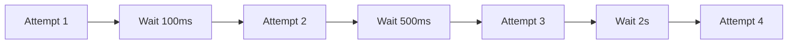
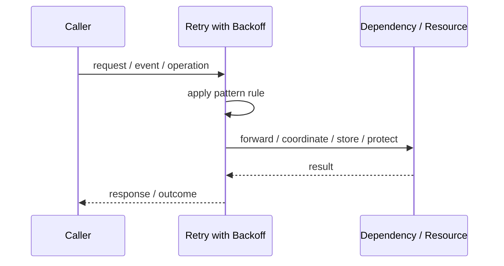
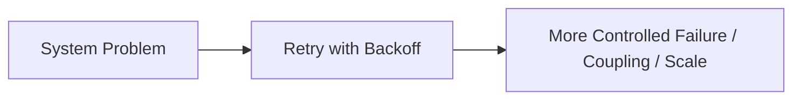

# Retry with Backoff

## Core Idea

Retry with Backoff waits longer between retry attempts, often using exponential backoff and jitter.

---

## Problem It Solves

Immediate retries can overload a struggling dependency and make failures worse.

---

## 3 Concrete Examples

### Example 1: Cloud API Rate Limits

A client backs off after receiving 429 Too Many Requests.

### Example 2: Database Failover

A service retries connection attempts with increasing delay while the database leader changes.

### Example 3: Message Publishing

A worker retries message publish attempts with jitter to avoid synchronized retry storms.

---

## Architect Questions

- What delay strategy should be used?
- Should jitter be added?
- What is the maximum delay?
- How many attempts are allowed?
- Which errors deserve backoff?
- How does this interact with timeouts and circuit breakers?

---

## Main Diagram



---

## Runtime / Responsibility Flow



---

## Implementation Shape

```txt
1. Identify the exact failure, scaling, coupling, or consistency problem.
2. Define the boundary where this pattern applies.
3. Define ownership: who owns data, policy, configuration, and failure handling.
4. Define the happy path and the failure path.
5. Add observability: logs, metrics, tracing, alerts, and dashboards.
6. Add tests for normal behavior, failure behavior, retry behavior, and edge cases.
7. Keep the pattern focused. Do not let it become a dumping ground for unrelated business logic.
```

---

## When to Use

- Retries are needed but the dependency may be overloaded.
- Rate limits or transient outages are common.
- You want to avoid retry storms.

---

## When Not to Use

- User-facing paths with tight latency budgets.
- Non-idempotent operations without idempotency keys.
- Permanent errors.

---

## Common Smell That Suggests This Pattern

```txt
The current design is failing because one part of the system is overloaded,
too tightly coupled,
not isolated enough,
or not reliable enough under failure.
```

---

## Common Mistakes

```txt
Using the pattern name without enforcing the actual boundary.

Adding distributed-systems complexity before the problem is real.

Ignoring failure modes.

Ignoring duplicate requests or duplicate messages.

Forgetting observability.

Letting the pattern hide business logic instead of clarifying it.
```

---

## Best Visual Summary



## Final Meaning

Retry with Backoff is useful only when it solves a real architectural pressure. If the pressure is not real yet, this pattern can become unnecessary complexity.
