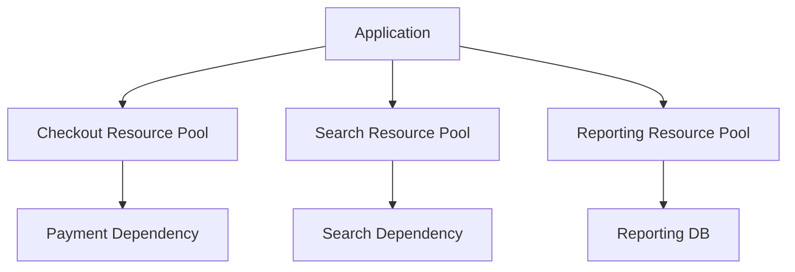
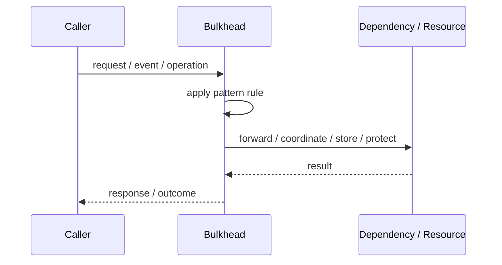
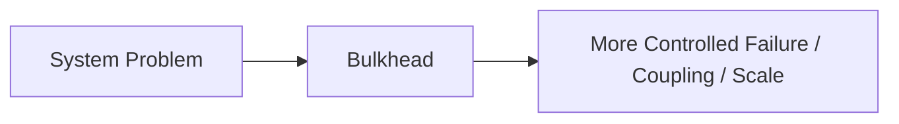

# Bulkhead

## Core Idea

Bulkhead isolates resources so failure in one area does not take down the entire system.

---

## Problem It Solves

A failure or overload in one part of the system can consume all shared resources and sink unrelated parts.

---

## 3 Concrete Examples

### Example 1: Separate Thread Pools

Payment calls use a separate thread pool from product search calls.

### Example 2: Tenant Isolation

One noisy tenant cannot consume all worker capacity.

### Example 3: Connection Pool Isolation

Reporting queries use a separate DB pool from checkout queries.

---

## Architect Questions

- Which workloads can starve others?
- What resources should be isolated?
- What limits should each bulkhead have?
- What happens when a bulkhead is full?
- Which workloads are business-critical?
- How will isolation be monitored?

---

## Main Diagram



---

## Runtime / Responsibility Flow



---

## Implementation Shape

```txt
1. Identify the exact failure, scaling, coupling, or consistency problem.
2. Define the boundary where this pattern applies.
3. Define ownership: who owns data, policy, configuration, and failure handling.
4. Define the happy path and the failure path.
5. Add observability: logs, metrics, tracing, alerts, and dashboards.
6. Add tests for normal behavior, failure behavior, retry behavior, and edge cases.
7. Keep the pattern focused. Do not let it become a dumping ground for unrelated business logic.
```

---

## When to Use

- Workloads have different criticality.
- Resource exhaustion in one path must not affect others.
- You need predictable failure containment.

---

## When Not to Use

- The system is small and resource contention is not a problem.
- Isolation overhead would waste scarce resources.
- You cannot define meaningful workload boundaries.

---

## Common Smell That Suggests This Pattern

```txt
The current design is failing because one part of the system is overloaded,
too tightly coupled,
not isolated enough,
or not reliable enough under failure.
```

---

## Common Mistakes

```txt
Using the pattern name without enforcing the actual boundary.

Adding distributed-systems complexity before the problem is real.

Ignoring failure modes.

Ignoring duplicate requests or duplicate messages.

Forgetting observability.

Letting the pattern hide business logic instead of clarifying it.
```

---

## Best Visual Summary



## Final Meaning

Bulkhead is useful only when it solves a real architectural pressure. If the pressure is not real yet, this pattern can become unnecessary complexity.
