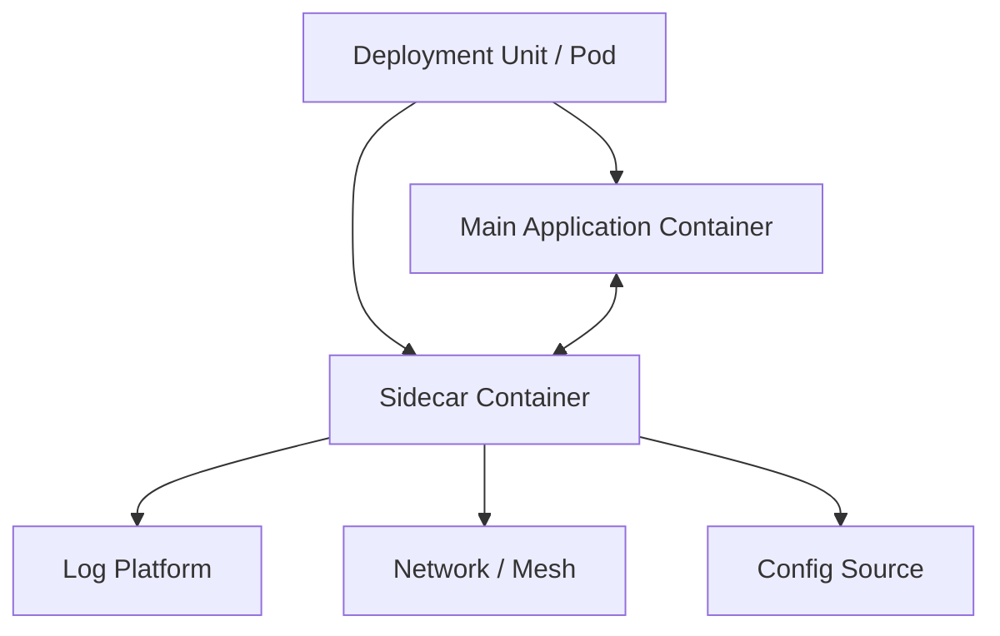
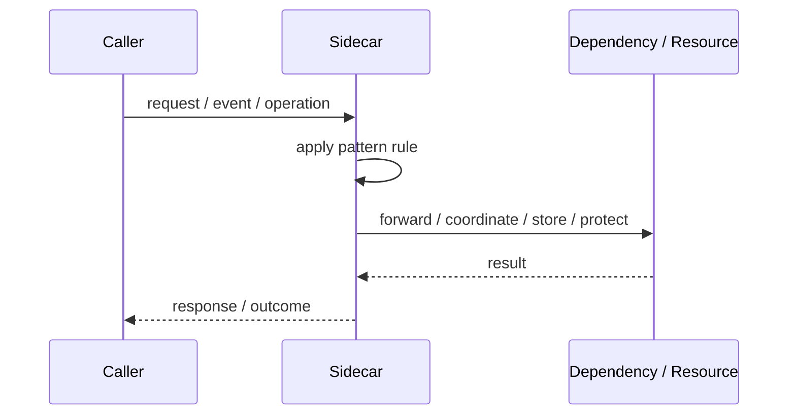
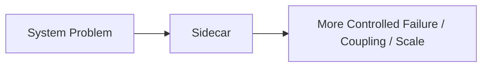

# Sidecar

## Core Idea

A sidecar is a companion process deployed alongside an application service. It provides auxiliary functionality while the main service focuses on business logic.

---

## Problem It Solves

A service needs supporting capabilities like logging, proxying, configuration, or security without embedding that logic into the service itself.

---

## 3 Concrete Examples

### Example 1: Logging Sidecar

A sidecar collects and forwards logs from the main container.

### Example 2: Service Mesh Proxy

An Envoy-like sidecar handles mTLS, retries, and telemetry.

### Example 3: Configuration Sidecar

A sidecar watches config changes and updates local files used by the app.

---

## Architect Questions

- What cross-cutting capability should be externalized?
- Should every service get the same sidecar?
- How will the sidecar and app communicate?
- What happens if the sidecar fails?
- Does the sidecar add latency or operational complexity?
- Who owns the sidecar configuration?

---

## Main Diagram



---

## Runtime / Responsibility Flow



---

## Implementation Shape

```txt
1. Identify the exact failure, scaling, coupling, or consistency problem.
2. Define the boundary where this pattern applies.
3. Define ownership: who owns data, policy, configuration, and failure handling.
4. Define the happy path and the failure path.
5. Add observability: logs, metrics, tracing, alerts, and dashboards.
6. Add tests for normal behavior, failure behavior, retry behavior, and edge cases.
7. Keep the pattern focused. Do not let it become a dumping ground for unrelated business logic.
```

---

## When to Use

- A supporting concern should be deployed next to the app.
- You want consistent infrastructure behavior across services.
- The app should not embed platform-specific logic.

---

## When Not to Use

- The sidecar is more complex than the app.
- A library or platform feature is simpler.
- The failure relationship between app and sidecar is unclear.

---

## Common Smell That Suggests This Pattern

```txt
The current design is failing because one part of the system is overloaded,
too tightly coupled,
not isolated enough,
or not reliable enough under failure.
```

---

## Common Mistakes

```txt
Using the pattern name without enforcing the actual boundary.

Adding distributed-systems complexity before the problem is real.

Ignoring failure modes.

Ignoring duplicate requests or duplicate messages.

Forgetting observability.

Letting the pattern hide business logic instead of clarifying it.
```

---

## Best Visual Summary



## Final Meaning

Sidecar is useful only when it solves a real architectural pressure. If the pressure is not real yet, this pattern can become unnecessary complexity.
