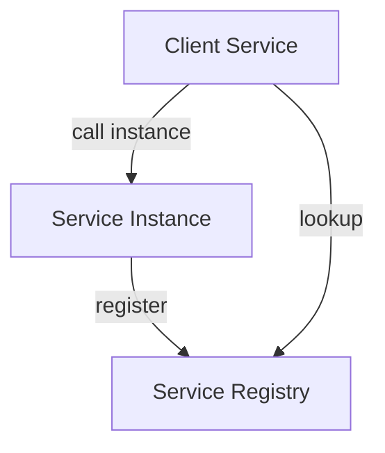
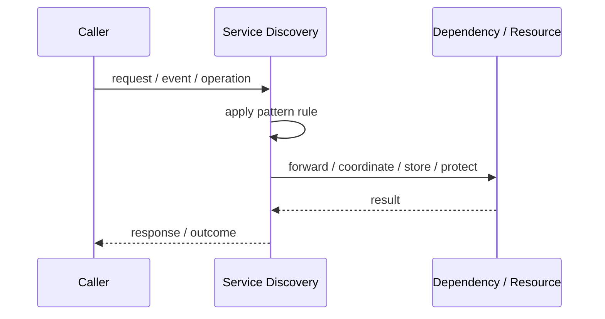
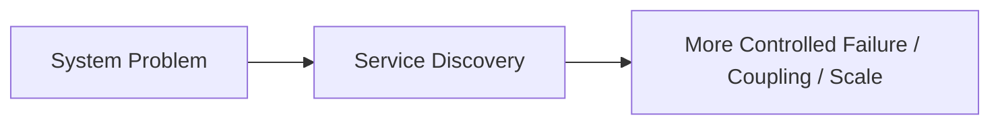

# Service Discovery

## Core Idea

Service Discovery lets clients locate available service instances through a registry, DNS, or platform mechanism.

---

## Problem It Solves

Services need to find each other dynamically because instances scale up, scale down, move, or fail.

---

## 3 Concrete Examples

### Example 1: Kubernetes Service Discovery

Services call stable DNS names instead of individual pod IPs.

### Example 2: Registry-Based Discovery

Instances register with Consul or Eureka and clients query available endpoints.

### Example 3: Client-Side Load Balancing

A client fetches healthy service instances and chooses one.

---

## Architect Questions

- Who registers service instances?
- Who discovers service instances?
- Is discovery client-side or server-side?
- How are unhealthy instances removed?
- How does load balancing work?
- What happens if the registry is unavailable?

---

## Main Diagram



---

## Runtime / Responsibility Flow



---

## Implementation Shape

```txt
1. Identify the exact failure, scaling, coupling, or consistency problem.
2. Define the boundary where this pattern applies.
3. Define ownership: who owns data, policy, configuration, and failure handling.
4. Define the happy path and the failure path.
5. Add observability: logs, metrics, tracing, alerts, and dashboards.
6. Add tests for normal behavior, failure behavior, retry behavior, and edge cases.
7. Keep the pattern focused. Do not let it become a dumping ground for unrelated business logic.
```

---

## When to Use

- Service instances are dynamic.
- You run multiple instances per service.
- Clients should not hardcode hostnames or IP addresses.

---

## When Not to Use

- The deployment topology is static and tiny.
- A platform-level mechanism already solves discovery.
- The registry would become an unmanaged single point of failure.

---

## Common Smell That Suggests This Pattern

```txt
The current design is failing because one part of the system is overloaded,
too tightly coupled,
not isolated enough,
or not reliable enough under failure.
```

---

## Common Mistakes

```txt
Using the pattern name without enforcing the actual boundary.

Adding distributed-systems complexity before the problem is real.

Ignoring failure modes.

Ignoring duplicate requests or duplicate messages.

Forgetting observability.

Letting the pattern hide business logic instead of clarifying it.
```

---

## Best Visual Summary



## Final Meaning

Service Discovery is useful only when it solves a real architectural pressure. If the pressure is not real yet, this pattern can become unnecessary complexity.
