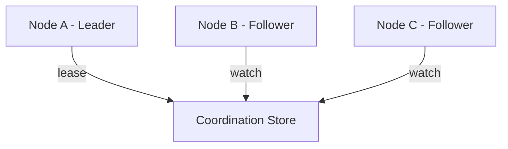
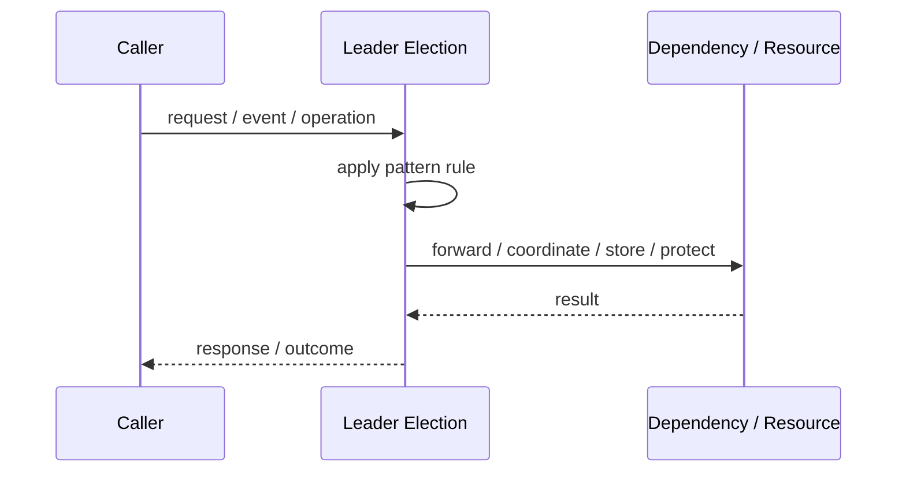
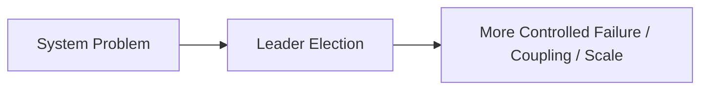

# Leader Election

## Core Idea

Leader Election selects one node as the leader while others act as followers or standby nodes.

---

## Problem It Solves

A distributed system has multiple nodes, but only one should perform a specific coordinating task at a time.

---

## 3 Concrete Examples

### Example 1: Scheduled Job Coordinator

Only one node runs a periodic cleanup job.

### Example 2: Cluster Primary Node

One node coordinates writes or metadata updates.

### Example 3: Failover Controller

A backup node becomes leader if the current leader fails.

---

## Architect Questions

- What task requires a single active coordinator?
- How is leadership acquired and renewed?
- How is leader failure detected?
- How is split-brain prevented?
- What happens during leadership transition?
- Does the leader need persistent fencing tokens?

---

## Main Diagram



---

## Runtime / Responsibility Flow



---

## Implementation Shape

```txt
1. Identify the exact failure, scaling, coupling, or consistency problem.
2. Define the boundary where this pattern applies.
3. Define ownership: who owns data, policy, configuration, and failure handling.
4. Define the happy path and the failure path.
5. Add observability: logs, metrics, tracing, alerts, and dashboards.
6. Add tests for normal behavior, failure behavior, retry behavior, and edge cases.
7. Keep the pattern focused. Do not let it become a dumping ground for unrelated business logic.
```

---

## When to Use

- Only one node should perform a task.
- Failover is required.
- A coordination system exists.

---

## When Not to Use

- Multiple nodes can safely perform the work.
- The system cannot tolerate leadership gaps.
- Split-brain prevention is not designed.

---

## Common Smell That Suggests This Pattern

```txt
The current design is failing because one part of the system is overloaded,
too tightly coupled,
not isolated enough,
or not reliable enough under failure.
```

---

## Common Mistakes

```txt
Using the pattern name without enforcing the actual boundary.

Adding distributed-systems complexity before the problem is real.

Ignoring failure modes.

Ignoring duplicate requests or duplicate messages.

Forgetting observability.

Letting the pattern hide business logic instead of clarifying it.
```

---

## Best Visual Summary



## Final Meaning

Leader Election is useful only when it solves a real architectural pressure. If the pressure is not real yet, this pattern can become unnecessary complexity.
