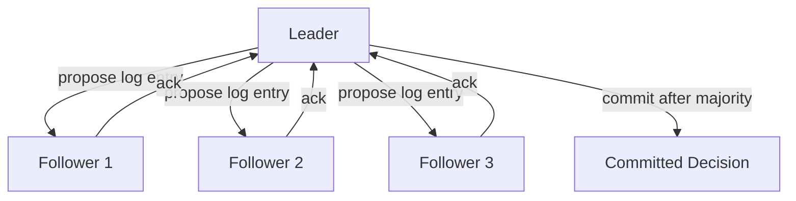
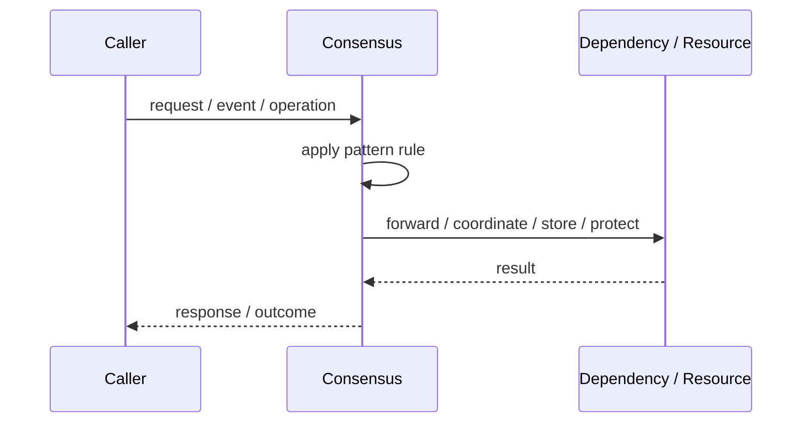
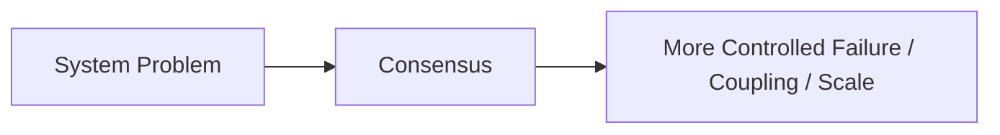

# Consensus

## Core Idea

Consensus algorithms let distributed nodes agree on decisions such as leader identity, committed log entries, or configuration changes.

---

## Problem It Solves

Distributed nodes need to agree on a value or state despite failures, delays, and partial network problems.

---

## 3 Concrete Examples

### Example 1: Distributed Database Replication

Nodes agree on committed writes.

### Example 2: Cluster Membership

Nodes agree which members are active.

### Example 3: Configuration Store

A cluster agrees on configuration values.

---

## Architect Questions

- What value must nodes agree on?
- How many failures must the system tolerate?
- What quorum size is required?
- What consistency guarantees are needed?
- What happens under network partition?
- Is implementing consensus yourself avoidable?

---

## Main Diagram



---

## Runtime / Responsibility Flow



---

## Implementation Shape

```txt
1. Identify the exact failure, scaling, coupling, or consistency problem.
2. Define the boundary where this pattern applies.
3. Define ownership: who owns data, policy, configuration, and failure handling.
4. Define the happy path and the failure path.
5. Add observability: logs, metrics, tracing, alerts, and dashboards.
6. Add tests for normal behavior, failure behavior, retry behavior, and edge cases.
7. Keep the pattern focused. Do not let it become a dumping ground for unrelated business logic.
```

---

## When to Use

- Strong agreement is required.
- Cluster metadata or writes must be consistent.
- You need fault-tolerant coordination.

---

## When Not to Use

- Eventual consistency is enough.
- You can use a proven system instead.
- The team intends to implement a custom consensus algorithm casually.

---

## Common Smell That Suggests This Pattern

```txt
The current design is failing because one part of the system is overloaded,
too tightly coupled,
not isolated enough,
or not reliable enough under failure.
```

---

## Common Mistakes

```txt
Using the pattern name without enforcing the actual boundary.

Adding distributed-systems complexity before the problem is real.

Ignoring failure modes.

Ignoring duplicate requests or duplicate messages.

Forgetting observability.

Letting the pattern hide business logic instead of clarifying it.
```

---

## Best Visual Summary



## Final Meaning

Consensus is useful only when it solves a real architectural pressure. If the pressure is not real yet, this pattern can become unnecessary complexity.
