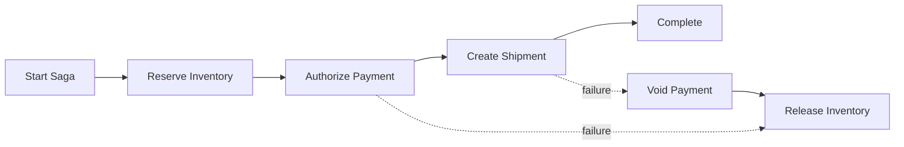
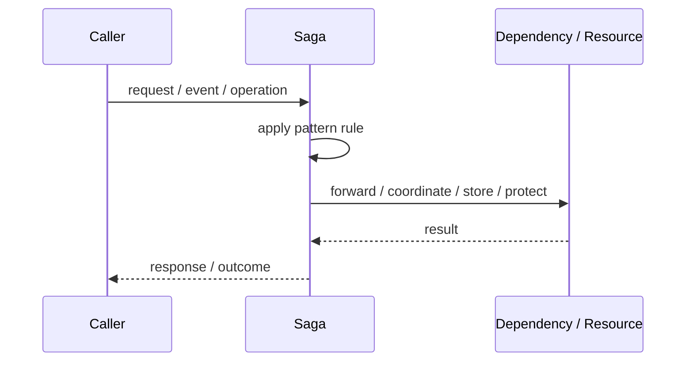
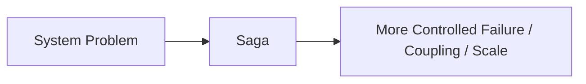

# Saga

## Core Idea

Saga breaks a distributed transaction into a sequence of local transactions with compensating actions for failure.

---

## Problem It Solves

A business transaction spans multiple services or databases where a single ACID transaction is not practical.

---

## 3 Concrete Examples

### Example 1: Order Checkout

Reserve inventory, charge payment, create shipment; compensate if payment fails.

### Example 2: Travel Booking

Book flight, hotel, and car; cancel prior reservations if a later step fails.

### Example 3: Account Opening

Create customer, run compliance checks, open account; roll back with compensating steps.

---

## Architect Questions

- What are the local transaction steps?
- What compensation exists for each completed step?
- Is orchestration or choreography better?
- What failures can happen at each step?
- Can the system tolerate eventual consistency?
- How are retries and idempotency handled?

---

## Main Diagram



---

## Runtime / Responsibility Flow



---

## Implementation Shape

```txt
1. Identify the exact failure, scaling, coupling, or consistency problem.
2. Define the boundary where this pattern applies.
3. Define ownership: who owns data, policy, configuration, and failure handling.
4. Define the happy path and the failure path.
5. Add observability: logs, metrics, tracing, alerts, and dashboards.
6. Add tests for normal behavior, failure behavior, retry behavior, and edge cases.
7. Keep the pattern focused. Do not let it become a dumping ground for unrelated business logic.
```

---

## When to Use

- A transaction spans services.
- Compensation is possible.
- Eventual consistency is acceptable.
- You need business-level rollback behavior.

---

## When Not to Use

- A single local transaction is enough.
- Compensation is impossible or legally invalid.
- The workflow requires strict immediate atomicity.

---

## Common Smell That Suggests This Pattern

```txt
The current design is failing because one part of the system is overloaded,
too tightly coupled,
not isolated enough,
or not reliable enough under failure.
```

---

## Common Mistakes

```txt
Using the pattern name without enforcing the actual boundary.

Adding distributed-systems complexity before the problem is real.

Ignoring failure modes.

Ignoring duplicate requests or duplicate messages.

Forgetting observability.

Letting the pattern hide business logic instead of clarifying it.
```

---

## Best Visual Summary



## Final Meaning

Saga is useful only when it solves a real architectural pressure. If the pressure is not real yet, this pattern can become unnecessary complexity.
