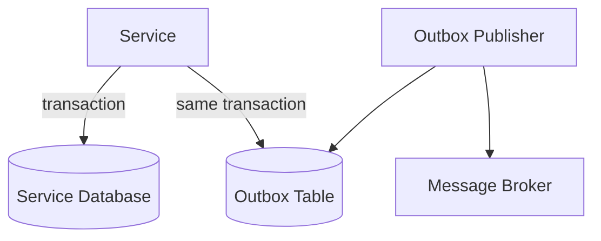
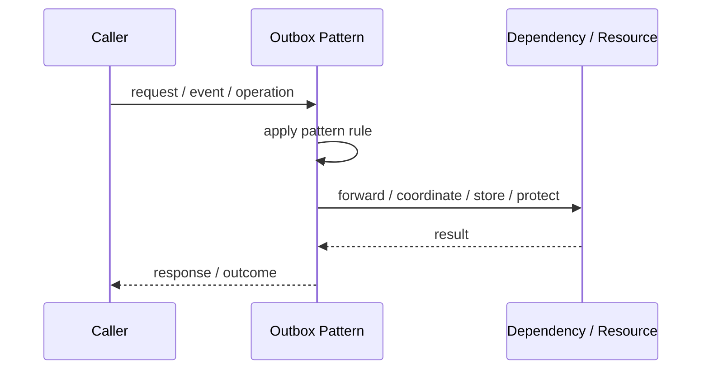
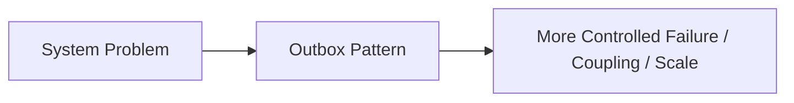

# Outbox Pattern

## Core Idea

The Outbox Pattern writes the business change and outgoing message into the same database transaction. A separate publisher later sends the message.

---

## Problem It Solves

A service must update its database and publish a message, but doing those two actions separately can create inconsistent state.

---

## 3 Concrete Examples

### Example 1: OrderCreated Event

Order service saves order and writes OrderCreated into an outbox table in one transaction.

### Example 2: PaymentCompleted Event

Payment service records payment and queues event for publishing.

### Example 3: UserRegistered Email Event

User service writes user and outbox event atomically.

---

## Architect Questions

- What business change requires an outgoing event?
- Can the event be stored in the same transaction?
- Who publishes outbox records?
- How are duplicates handled?
- When are outbox records marked published?
- How is ordering handled?

---

## Main Diagram



---

## Runtime / Responsibility Flow



---

## Implementation Shape

```txt
1. Identify the exact failure, scaling, coupling, or consistency problem.
2. Define the boundary where this pattern applies.
3. Define ownership: who owns data, policy, configuration, and failure handling.
4. Define the happy path and the failure path.
5. Add observability: logs, metrics, tracing, alerts, and dashboards.
6. Add tests for normal behavior, failure behavior, retry behavior, and edge cases.
7. Keep the pattern focused. Do not let it become a dumping ground for unrelated business logic.
```

---

## When to Use

- Database updates and event publishing must stay consistent.
- At-least-once publishing is acceptable.
- Consumers can handle duplicate messages.

---

## When Not to Use

- No outgoing messages are needed.
- You require exactly-once end-to-end behavior without duplicate handling.
- A simpler synchronous call is sufficient.

---

## Common Smell That Suggests This Pattern

```txt
The current design is failing because one part of the system is overloaded,
too tightly coupled,
not isolated enough,
or not reliable enough under failure.
```

---

## Common Mistakes

```txt
Using the pattern name without enforcing the actual boundary.

Adding distributed-systems complexity before the problem is real.

Ignoring failure modes.

Ignoring duplicate requests or duplicate messages.

Forgetting observability.

Letting the pattern hide business logic instead of clarifying it.
```

---

## Best Visual Summary



## Final Meaning

Outbox Pattern is useful only when it solves a real architectural pressure. If the pressure is not real yet, this pattern can become unnecessary complexity.
