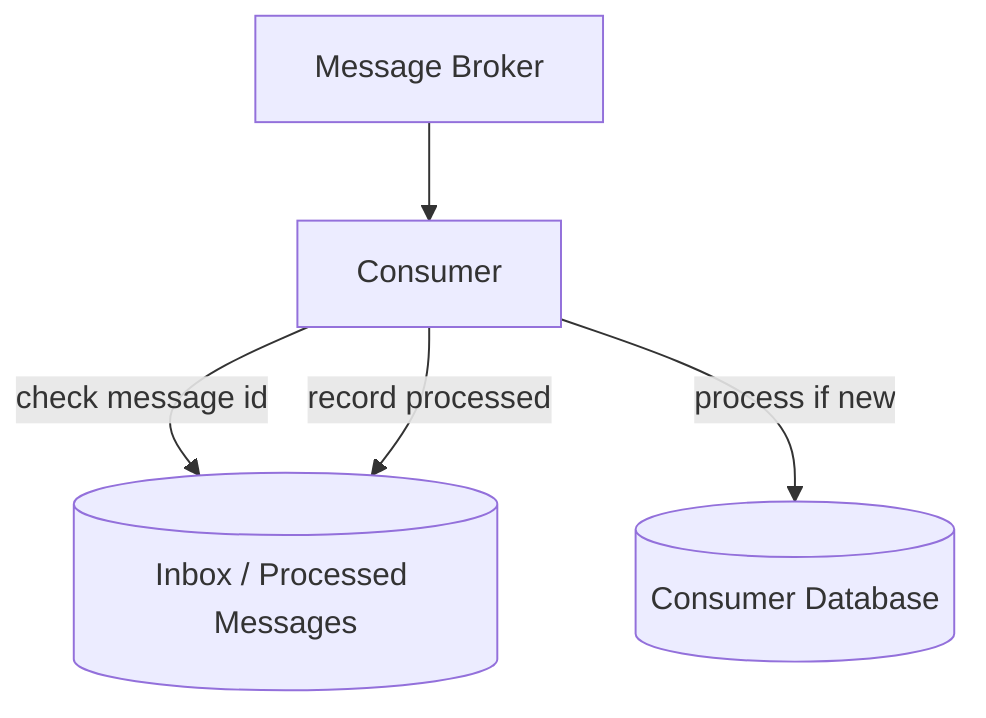
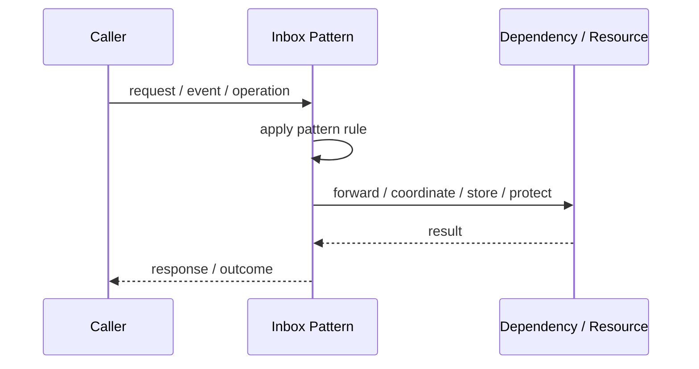
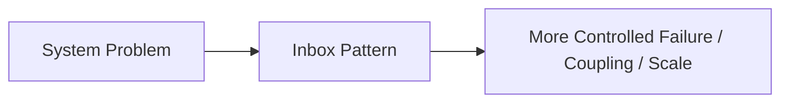

# Inbox Pattern

## Core Idea

The Inbox Pattern stores received message IDs before or during processing so duplicate messages can be detected and ignored.

---

## Problem It Solves

Message consumers may receive duplicate messages and accidentally process the same event more than once.

---

## 3 Concrete Examples

### Example 1: Payment Event Consumer

Order service ignores duplicate PaymentAuthorized events.

### Example 2: Email Consumer

Notification service avoids sending the same email twice.

### Example 3: Projection Builder

Read model updater records processed event IDs.

---

## Architect Questions

- Can messages be delivered more than once?
- What is the unique message ID?
- Where are processed IDs stored?
- Is processing atomic with inbox recording?
- How long should inbox records be retained?
- What happens if processing fails midway?

---

## Main Diagram



---

## Runtime / Responsibility Flow



---

## Implementation Shape

```txt
1. Identify the exact failure, scaling, coupling, or consistency problem.
2. Define the boundary where this pattern applies.
3. Define ownership: who owns data, policy, configuration, and failure handling.
4. Define the happy path and the failure path.
5. Add observability: logs, metrics, tracing, alerts, and dashboards.
6. Add tests for normal behavior, failure behavior, retry behavior, and edge cases.
7. Keep the pattern focused. Do not let it become a dumping ground for unrelated business logic.
```

---

## When to Use

- Consumers need idempotent message handling.
- The broker provides at-least-once delivery.
- Duplicate side effects would be harmful.

---

## When Not to Use

- Messages are naturally idempotent and duplicates do not matter.
- The system does not use async messages.
- There is no reliable message ID.

---

## Common Smell That Suggests This Pattern

```txt
The current design is failing because one part of the system is overloaded,
too tightly coupled,
not isolated enough,
or not reliable enough under failure.
```

---

## Common Mistakes

```txt
Using the pattern name without enforcing the actual boundary.

Adding distributed-systems complexity before the problem is real.

Ignoring failure modes.

Ignoring duplicate requests or duplicate messages.

Forgetting observability.

Letting the pattern hide business logic instead of clarifying it.
```

---

## Best Visual Summary



## Final Meaning

Inbox Pattern is useful only when it solves a real architectural pressure. If the pressure is not real yet, this pattern can become unnecessary complexity.
