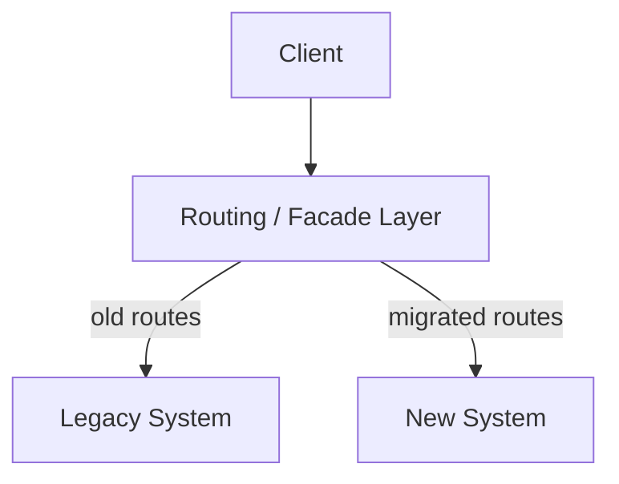
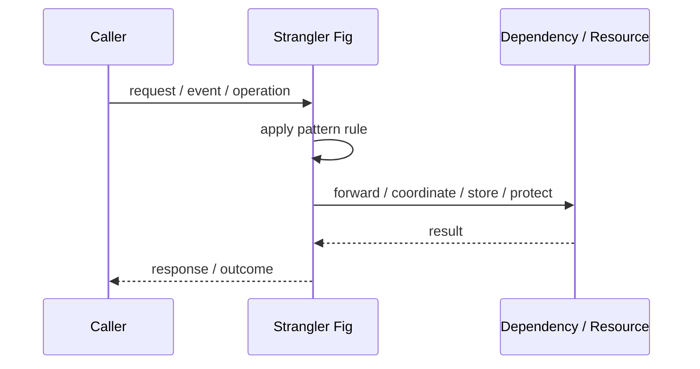
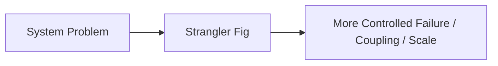

# Strangler Fig

## Core Idea

Strangler Fig wraps the old system and incrementally routes features to a new system until the old system is retired.

---

## Problem It Solves

A legacy system must be replaced gradually without a risky big-bang rewrite.

---

## 3 Concrete Examples

### Example 1: Legacy Monolith Migration

New order APIs are routed to a new service while old features stay in the monolith.

### Example 2: UI Replacement

New frontend pages replace old pages one route at a time.

### Example 3: Database Modernization

New capabilities are built around a legacy database until ownership is moved.

---

## Architect Questions

- Which legacy capability should be replaced first?
- Where can routing be intercepted?
- How will old and new systems share data during transition?
- What is the rollback plan?
- How will parity be validated?
- When is the legacy part retired?

---

## Main Diagram



---

## Runtime / Responsibility Flow



---

## Implementation Shape

```txt
1. Identify the exact failure, scaling, coupling, or consistency problem.
2. Define the boundary where this pattern applies.
3. Define ownership: who owns data, policy, configuration, and failure handling.
4. Define the happy path and the failure path.
5. Add observability: logs, metrics, tracing, alerts, and dashboards.
6. Add tests for normal behavior, failure behavior, retry behavior, and edge cases.
7. Keep the pattern focused. Do not let it become a dumping ground for unrelated business logic.
```

---

## When to Use

- A full rewrite is too risky.
- Legacy capabilities can be replaced incrementally.
- Routing or interception is possible.

---

## When Not to Use

- The legacy system is small enough to replace safely.
- Old and new data cannot coexist.
- No one will actually retire the strangled legacy parts.

---

## Common Smell That Suggests This Pattern

```txt
The current design is failing because one part of the system is overloaded,
too tightly coupled,
not isolated enough,
or not reliable enough under failure.
```

---

## Common Mistakes

```txt
Using the pattern name without enforcing the actual boundary.

Adding distributed-systems complexity before the problem is real.

Ignoring failure modes.

Ignoring duplicate requests or duplicate messages.

Forgetting observability.

Letting the pattern hide business logic instead of clarifying it.
```

---

## Best Visual Summary



## Final Meaning

Strangler Fig is useful only when it solves a real architectural pressure. If the pressure is not real yet, this pattern can become unnecessary complexity.
