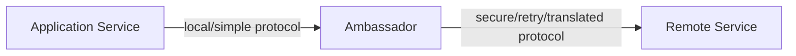
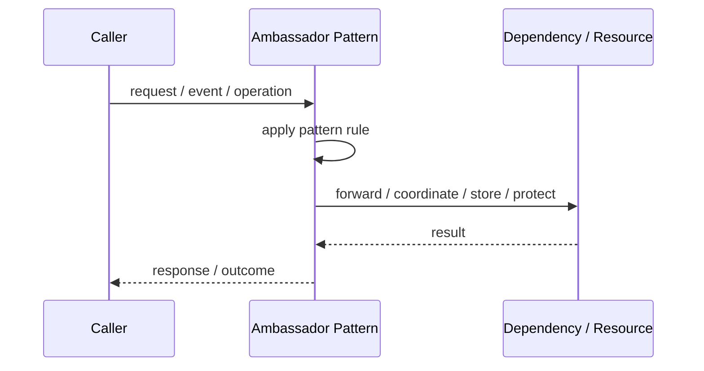
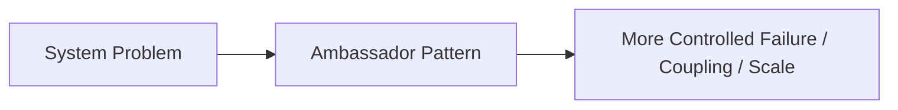

# Ambassador Pattern

## Core Idea

An Ambassador acts as a helper proxy for a service, handling outbound connectivity concerns such as retries, TLS, routing, or protocol translation.

---

## Problem It Solves

A service needs helper behavior for outbound communication without embedding that behavior in the application.

---

## 3 Concrete Examples

### Example 1: Outbound API Helper

An ambassador handles retries and auth for external API calls.

### Example 2: Legacy Protocol Translator

A service calls localhost HTTP while ambassador speaks legacy TCP to the external system.

### Example 3: Database Connection Helper

Ambassador manages secure connection setup to a remote database.

---

## Architect Questions

- Which outbound concern should be separated from the app?
- Is this a sidecar-like deployment?
- What protocol translation is needed?
- How does the app communicate with the ambassador?
- What happens if the ambassador fails?
- Is this better handled by a library or service mesh?

---

## Main Diagram



---

## Runtime / Responsibility Flow



---

## Implementation Shape

```txt
1. Identify the exact failure, scaling, coupling, or consistency problem.
2. Define the boundary where this pattern applies.
3. Define ownership: who owns data, policy, configuration, and failure handling.
4. Define the happy path and the failure path.
5. Add observability: logs, metrics, tracing, alerts, and dashboards.
6. Add tests for normal behavior, failure behavior, retry behavior, and edge cases.
7. Keep the pattern focused. Do not let it become a dumping ground for unrelated business logic.
```

---

## When to Use

- Outbound communication logic should be externalized.
- Legacy or remote protocols should be hidden from the app.
- Multiple services need the same communication helper.

---

## When Not to Use

- A simple client library is enough.
- The ambassador adds more failure points than value.
- Business logic starts moving into the ambassador.

---

## Common Smell That Suggests This Pattern

```txt
The current design is failing because one part of the system is overloaded,
too tightly coupled,
not isolated enough,
or not reliable enough under failure.
```

---

## Common Mistakes

```txt
Using the pattern name without enforcing the actual boundary.

Adding distributed-systems complexity before the problem is real.

Ignoring failure modes.

Ignoring duplicate requests or duplicate messages.

Forgetting observability.

Letting the pattern hide business logic instead of clarifying it.
```

---

## Best Visual Summary



## Final Meaning

Ambassador Pattern is useful only when it solves a real architectural pressure. If the pressure is not real yet, this pattern can become unnecessary complexity.
