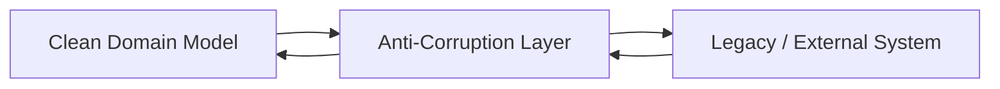
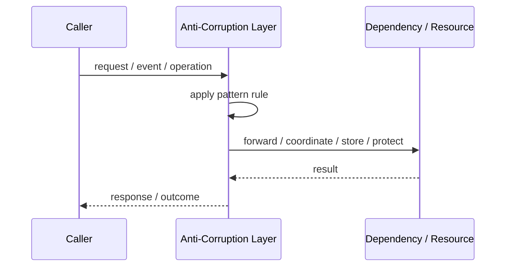
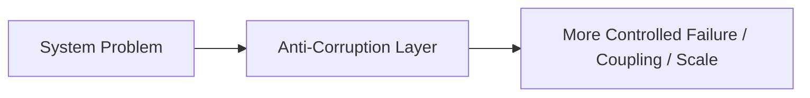

# Anti-Corruption Layer

## Core Idea

An Anti-Corruption Layer translates between your model and an external model so external assumptions do not leak into your domain.

---

## Problem It Solves

A clean domain model must integrate with an external or legacy system whose concepts, data model, or language would pollute the new system.

---

## 3 Concrete Examples

### Example 1: Legacy CRM Integration

Customer records with old field names are translated into clean domain objects.

### Example 2: External Payment Provider

Vendor-specific statuses are mapped to internal payment states.

### Example 3: ERP Boundary

ERP product codes and workflows are isolated behind translation services.

---

## Architect Questions

- What external model would corrupt our domain language?
- What translations are required?
- Which concepts do not map cleanly?
- Should the ACL be synchronous, asynchronous, or both?
- How are errors and statuses mapped?
- Where is the boundary owned?

---

## Main Diagram



---

## Runtime / Responsibility Flow



---

## Implementation Shape

```txt
1. Identify the exact failure, scaling, coupling, or consistency problem.
2. Define the boundary where this pattern applies.
3. Define ownership: who owns data, policy, configuration, and failure handling.
4. Define the happy path and the failure path.
5. Add observability: logs, metrics, tracing, alerts, and dashboards.
6. Add tests for normal behavior, failure behavior, retry behavior, and edge cases.
7. Keep the pattern focused. Do not let it become a dumping ground for unrelated business logic.
```

---

## When to Use

- A legacy or external model does not match your domain.
- You want to protect clean domain language.
- Vendor concepts should not spread through your code.

---

## When Not to Use

- The external model already matches your domain.
- A simple adapter is enough.
- The ACL becomes a place for unrelated business logic.

---

## Common Smell That Suggests This Pattern

```txt
The current design is failing because one part of the system is overloaded,
too tightly coupled,
not isolated enough,
or not reliable enough under failure.
```

---

## Common Mistakes

```txt
Using the pattern name without enforcing the actual boundary.

Adding distributed-systems complexity before the problem is real.

Ignoring failure modes.

Ignoring duplicate requests or duplicate messages.

Forgetting observability.

Letting the pattern hide business logic instead of clarifying it.
```

---

## Best Visual Summary



## Final Meaning

Anti-Corruption Layer is useful only when it solves a real architectural pressure. If the pressure is not real yet, this pattern can become unnecessary complexity.
