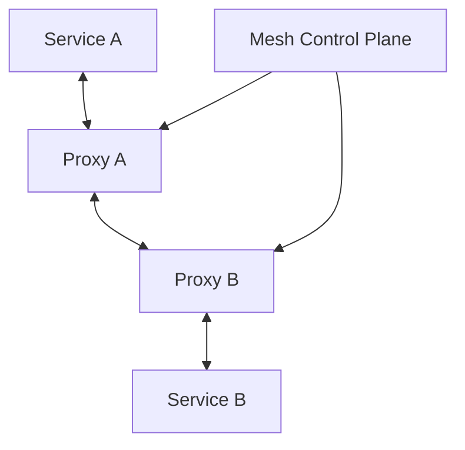
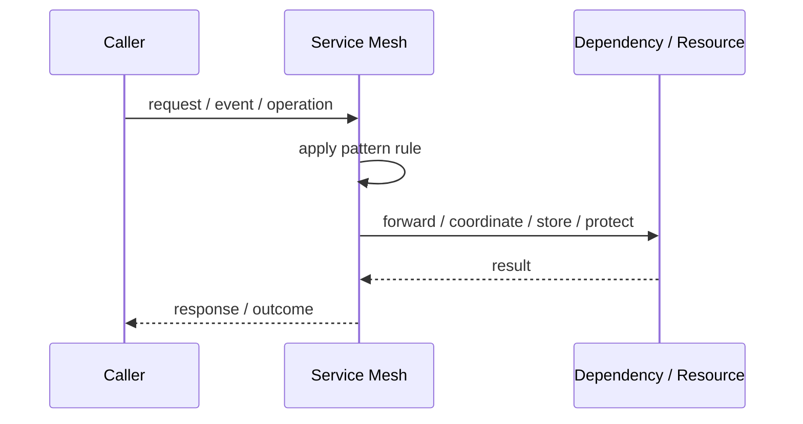
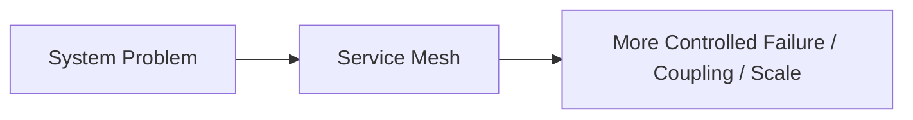

# Service Mesh

## Core Idea

A Service Mesh moves network concerns such as mTLS, retries, routing, telemetry, and policy enforcement into infrastructure proxies.

---

## Problem It Solves

Microservices need consistent service-to-service traffic management, security, and observability without duplicating that code in every service.

---

## 3 Concrete Examples

### Example 1: mTLS Between Services

All service-to-service traffic is encrypted and authenticated by mesh proxies.

### Example 2: Traffic Splitting

5% of traffic is routed to a canary version.

### Example 3: Uniform Telemetry

Every service call produces standardized metrics and traces.

---

## Architect Questions

- Do we have enough services to justify a mesh?
- What traffic policies are needed?
- Will sidecar or ambient mode be used?
- How will certificates and identity work?
- Can the team operate the mesh reliably?
- Will the mesh obscure debugging?

---

## Main Diagram



---

## Runtime / Responsibility Flow



---

## Implementation Shape

```txt
1. Identify the exact failure, scaling, coupling, or consistency problem.
2. Define the boundary where this pattern applies.
3. Define ownership: who owns data, policy, configuration, and failure handling.
4. Define the happy path and the failure path.
5. Add observability: logs, metrics, tracing, alerts, and dashboards.
6. Add tests for normal behavior, failure behavior, retry behavior, and edge cases.
7. Keep the pattern focused. Do not let it become a dumping ground for unrelated business logic.
```

---

## When to Use

- You have many services with shared traffic/security needs.
- You need mTLS, traffic policy, and observability consistently.
- Platform teams can operate the mesh.

---

## When Not to Use

- You only have a few services.
- The team is not ready for mesh complexity.
- A gateway or library solves the actual problem.

---

## Common Smell That Suggests This Pattern

```txt
The current design is failing because one part of the system is overloaded,
too tightly coupled,
not isolated enough,
or not reliable enough under failure.
```

---

## Common Mistakes

```txt
Using the pattern name without enforcing the actual boundary.

Adding distributed-systems complexity before the problem is real.

Ignoring failure modes.

Ignoring duplicate requests or duplicate messages.

Forgetting observability.

Letting the pattern hide business logic instead of clarifying it.
```

---

## Best Visual Summary



## Final Meaning

Service Mesh is useful only when it solves a real architectural pressure. If the pressure is not real yet, this pattern can become unnecessary complexity.
